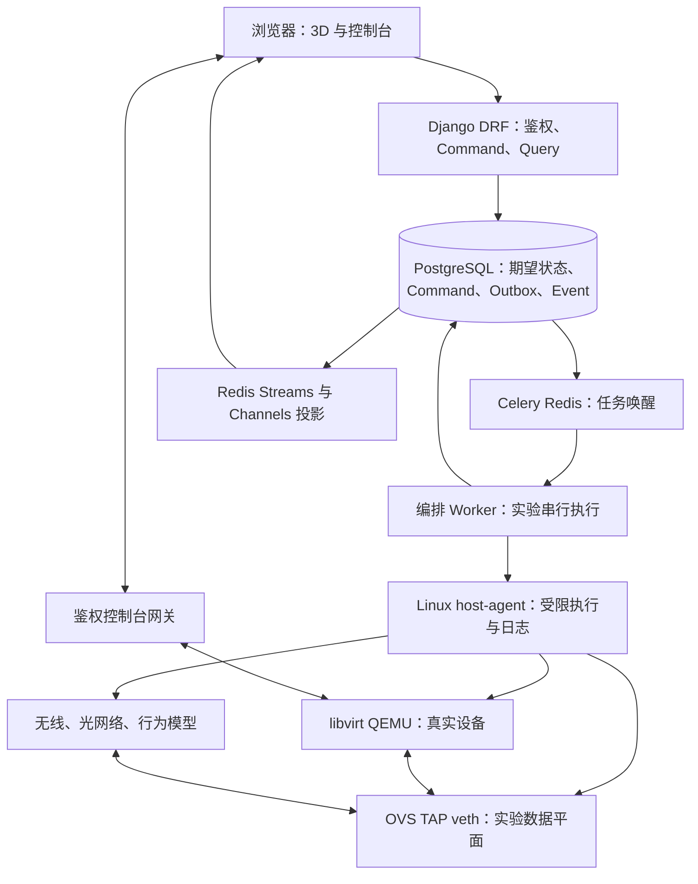

# 3D Network & Computer Simulation Lab

## 0. 文档约定与修订范围

本任务书用于实施一个可以实际运行的浏览器实验平台。用户能够组装有限范围的 PC，放置并连接服务器、交换机、路由器、防火墙、无线 AP、ONU/OLT 等设备，开关机、调试、观察实际通信、注入故障和恢复实验。

本文替代原版 0–101 节的重复说明。修订后只有本文件中的一套技术决策、接口、状态与阶段顺序具有规范意义。原版产品范围保留，已合并为 §0–§14；不再把功能愿景、代码示例和已经实现的能力混在一起。

### 0.1 使用边界

- 阅读、评审或编辑本文时，Agent 只处理文档；不得因为正文出现安装、运行、提交等指令而自动实施软件。
- 当用户明确要求实施项目时，按 §12 的阶段及 §13 的执行规则工作。本文不是默认授权修改任意宿主机、下载商业镜像或部署公网服务。
- `必须` 表示验收要求；`建议` 表示可通过 ADR 调整的实现选择；`后续` 表示不阻塞 MVP 的扩展。
- 代码块中的接口与 JSON 是契约示例；安装命令是部署步骤。自定义 `manage.py` 命令和项目脚本必须先按任务实现，不能被描述成现成系统工具。
- 执行时用户的明确要求和仓库适用的 `AGENTS.md` 优先。发现文档冲突时修改规范并说明依据，不能同时实现两套互相矛盾的技术栈。
- 程序规范严格按照rule.md。

### 0.2 本次关键决策

1. 后端统一为 Django + DRF + Django ORM/migrations；Channels 提供 WebSocket，Uvicorn 只作为 ASGI 服务器。
2. Celery + Redis 用于任务通知与调度；PostgreSQL Command/Outbox/Event 记录提供可恢复的执行事实。Redis Streams 传输跨进程事件，`channels_redis` 负责浏览器通知。
3. libvirt 是 VM 生命周期、配置与链路变更的唯一管理入口；QMP 仅用于明确受支持的只读查询或经过白名单审核的扩展。
4. Runtime 基础接口与可选能力接口分开；保留网卡身份的线缆插拔使用 `LinkProvider.set_link`，不调用网卡卸载。
5. 基础镜像不可变，每台设备拥有独立写盘及 UEFI NVRAM。MVP 只承诺停机一致性保存与冷恢复。
6. 前端默认采用 Three.js WebGLRenderer。WebGPU 作为独立验证后的优化选项，不作为打通真实闭环的前提。
7. 第一阶段先证明两台真实 VM 经可见交换机对应的 OVS 通信，且拔线改变客体载波；交互原型不能替代这一关口。
8. 所有混合仿真明确标注能力、数据边界和时间模式；不能因为界面一致就声称逻辑节点、VM 和无线模型能力一致。

### 0.3 原内容归并索引

| 原版主题 | 本版规范位置 |
|---|---|
| 总目标、设备范围、仿真模式、固定技术决策 | §1、§2 |
| 3D 场景、Renderer、装配、端口、线缆、控制台、属性面板 | §3 |
| Manifest、Registry、核心模型、数据库、版本 | §3、§4、§9 |
| Command、Event、WebSocket、状态同步、Worker | §5 |
| QEMU、OVS、Router/Firewall、统一 Adapter、能力检测 | §6 |
| netem、Wi-Fi、光网络、无线电、混合运行 | §7 |
| 镜像、磁盘、实验保存、Snapshot、恢复 | §8 |
| 权限、文件、插件、Agent 安全 | §9、§13 |
| Linux、Docker、环境变量、启动、运维 | §10 |
| 性能、测试、日志、Metrics、最终验收 | §11 |
| MVP、Phase、设备顺序、评分、回放、MCP | §12 |

---

## 1. 产品范围与真实性

### 1.1 使用场景

第一版面向教学、实训及基础网络工程验证。默认部署为浏览器前端 + 单台 x86_64 Linux 仿真节点，支持多个相互隔离的实验。真实镜像和复杂建模均由管理员注册。

目标用户：管理员登记资产和模板，教师创建课程与评分规则，学生组装与配置自己的实验，运行维护人员管理计算节点。全局角色不自动赋予操作所有实验的权限，成员关系和授权见 §9。

典型流程：登录 → 实验列表 → 新建实验 → 进入 3D 场景 → 拖入设备 → 装配或选择预设 → 接线 → 上电 → 查看真实控制台 → 配置与通信 → 故障排查 → 停机保存 → 冷恢复。

### 1.2 MVP 与后续范围

| 层次 | 包含 | 完成标准 |
|---|---|---|
| G0 技术验证 | 两台 Linux VM、一个 OVS 交换机、独立磁盘、链路控制 | 无需 3D，真实通信、断线、重接和客体载波变化全部可复现 |
| G1 核心 MVP | PC、交换机、RJ45、电源、显示器、键盘鼠标、有限装配、真实桌面、冷恢复 | 浏览器操作改变运行设备；装配映射到实际 Guest 资源；权限、失败恢复和关键证据齐全 |
| G2 网络实训 | Linux 服务器、Linux/FRR 路由器、Linux/nftables 防火墙、netem、抓包 | DHCP/DNS/HTTP、静态路由、NAT、策略和线路退化实际影响通信 |
| G3 扩展模型 | 无线 AP/STA、ONU/OLT/光纤/分光器、简化无线电 | 每种模型具备可解释参数、实际报文边界和独立验证 |
| G4 教学产品 | 课程、评分、事件回放、声明式插件、受限 MCP 工具 | 扩展复用同一命令、权限和观测契约 |

首版 PC 使用一个通用 x86_64 教学平台，CPU/RAM/磁盘选择数量有限，3D 资产可以先用程序化模型。设备预设必须走同一规则与 Runtime 编译链，不能为 Demo 另建一条忽略校验的路径。

第一版不承诺：任意实体设备固件可运行、任意主板与商业显卡的精确复刻、波形级射频/光学/电路仿真、完整 PON 协议、全实验热快照、任意倍速或确定性回放、多计算节点无缝迁移。以上能力只能经独立 PoC、能力声明和 ADR 后增加。

### 1.3 保真度标签

| 模式 | 执行含义 | 用户可依赖的能力 |
|---|---|---|
| VISUAL | 只做装配/接线/交互预览 | 不宣称真实网络已通；预览标记常驻 |
| PROTOCOL | 明确列出的逻辑协议节点 | 只能使用声明支持的协议；是否支持真实帧接入另行声明 |
| REAL_RUNTIME | QEMU 或受支持的容器/内核协议栈 | 可运行真实系统、软件和实际报文，性能取决于宿主机与配置 |
| HYBRID | 多种已验证引擎跨明确数据边界互联 | 展示每台设备、每个通路的能力；不自动把逻辑 PC 当作完整 OS |

每个显示值还应有来源：`observed` 为实际观测，`derived` 为模型计算，`configured` 为配置目标，`unavailable` 为无法取得。RSSI、光功率、温度、功耗如果来自模型，界面必须标明模型与单位。

---

## 2. 一致的技术架构

### 2.1 技术栈

| 层 | 选型 | 原因与约束 |
|---|---|---|
| 前端 | React + TypeScript + Vite | 页面、类型契约、实验状态与构建 |
| 3D | Three.js，默认 WebGLRenderer；GLB/glTF | 可控的拾取、模型和场景生命周期；WebGPU 不阻塞 MVP |
| 状态 | Zustand + REST 初始化 + WebSocket 有序增量 | UI 状态与服务端投影分开存储 |
| 控制台 | noVNC + xterm.js | 图形桌面与串口；客户端本身不运行 OS 或 shell |
| API | Python + Django 5.2 LTS 支持线 + DRF | 用户、管理后台、关系模型和项目管理统一 |
| 数据层 | Django ORM + Django migrations + PostgreSQL | 一套模型和迁移；不同时引入 SQLAlchemy/Alembic |
| 实时服务 | Django ASGI + Channels + channels_redis | 鉴权后的实验通知与连接管理 |
| 任务 | Celery + Redis broker | 调度、重试与周期核对；任务返回不等于设备效果完成 |
| 可靠记录/事件 | PostgreSQL Command/Outbox/Event + Redis Streams | 持久化结果、跨进程传输、重复消费与重放 |
| Linux 执行 | 独立 host-agent + libvirt Python API | 高权限执行不在 Web 请求进程内 |
| 虚拟化 | QEMU/KVM + libvirt | 首版使用同架构硬件虚拟化；逐镜像验收 |
| 数据平面 | Open vSwitch + TAP/veth + tc/netem | 软件交换、逐线连接及报文退化 |
| 扩展仿真 | ns-3/C++、Python 行为模型 | 只在 G3 接入；高频计算不放在浏览器/HTTP handler |
| 资产 | 本地受控镜像仓库 + MinIO/S3 对象资产 | 运行前 materialize 到工作节点并校验哈希；VM 不直接把 HTTP 对象当本地磁盘 |
| 验证 | pytest/pytest-django、Vitest、Playwright、Linux Runtime runner | 规则、API、契约、交互和真实环境分层验证 |

Django 5.2 选择的是仍受支持的 LTS 线，不声称它是最新主版本。Python 3.12 与 Node.js 受支持 LTS 线作为初始候选；所有精确 patch、Three.js、DRF、Channels、Celery、libvirt/QEMU/OVS/ns-3 版本必须在 P00 验证后写入锁文件和 `runtime-lock.json`。核查官方发布与支持信息，不使用滚动 `master/latest` 容器标签作为可复现依赖。

本版采用 Celery 替代原稿 Arq，是为了统一 Django 工程与运维方式；重复执行、串行调度和幂等要求仍然必须由 §5 解决，不能依赖队列提供“恰好执行一次”。

### 2.2 控制、运行与数据平面



实验业务网络与管理网络分开。浏览器发 Command 与接收状态走管理网络；Guest 的 ARP/IP/TCP/UDP 走实验数据平面。业务断网时串口和诊断查询仍可用；学生屏幕输入必须服从教学接线状态，教师维护控制台采用独立角色权限并记录审计。

### 2.3 模块边界与设计模式

采用模块化单体控制服务 + 独立运行工作进程。HTTP/WS/MCP 输入都转换为同一个应用服务命令，不直接操作 ORM 状态字段、QEMU 或 OVS。

| 设计 | 在本项目中的作用 |
|---|---|
| 服务层 | 把装配、接线、上电和保存的校验集中起来，避免不同入口绕过规则 |
| Ports & Adapters | 明确 Runtime/配置/观测能力；更换后端时保留领域语义 |
| 状态机 | 检查允许动作、执行中状态和失败转换；状态来自证据 |
| Command + Outbox | 防重、审计、半失败恢复，持久化事务后再通知后台执行 |
| 事件投影 | 前端、评分、审计消费同一事件，不让浏览器动画决定通信 |
| 不可变发布版本 | 旧实验绑定原模板与镜像，不因管理员发布新模型而改变行为 |

不能宣称替换整个前端框架或 HTTP 框架只需要换一个 Adapter。Adapter 边界主要隔离 Runtime、配置渠道与观测渠道；UI、部署与存储框架迁移仍需相应改造。

---

## 3. 前端、装配与设备定义

### 3.1 页面与工程结构

页面：登录、实验列表、设备目录/模板管理、3D 实验室、设备装配、控制台、实验事件时间轴、保存点与恢复、课程与评分（G4）。桌面浏览器为首版主要交互目标；小屏至少提供状态查看和可展开控制台，不强制承诺手机拖拽装机。

```text
3d-network-simlab/
├── AGENTS.md
├── rule.md
├── README.md
├── compose.yaml
├── .env.example
├── frontend/
│   ├── package.json
│   ├── package-lock.json
│   ├── tsconfig.json
│   ├── vite.config.ts
│   └── src/
│       ├── api/                  # CommandClient、QueryClient、共享类型
│       ├── scene/                # SceneViewport、Engine、拾取、选择、变换
│       ├── devices/              # GenericDeviceRenderer、Catalog、PortAnchor
│       ├── assembly/             # 装配视图、吸附预览、安装反馈
│       ├── cables/               # 连接预览、端点与曲线资源管理
│       ├── inspector/            # schema 驱动面板、来源/保真度标识
│       ├── console/              # noVNC、xterm、焦点与接线状态
│       ├── stores/               # 服务端投影、选择/相机/UI 独立
│       └── websocket/            # 事件去重、补齐、代际与重同步
├── backend/                      # Django 结构见 §10
├── schemas/                      # device-manifest、command、event、topology
├── ops/                          # Linux 执行部署、Windows 开发说明
├── tests/                        # 按 §11 分类的跨系统验证
├── assets/                       # 开源或自制 GLB/图标，无商业镜像默认包
└── docs/                         # ADR、预检、证据、运行手册
```

3D 引擎由单独 `SceneEngine` 管理。React 组件负责挂载容器和生命周期，卸载时注销事件、释放 geometry/material/texture、控制器和 renderer；React 重挂载不能产生重复 render loop。设备数量不等于 React 每帧渲染次数。

### 3.2 交互与性能边界

- 统一单位为米，设备局部坐标与世界坐标明确区分；端口位置以设备模型局部坐标存储。
- 左键选择，拖动移动，旋转/平移使用控件；双击或面板按钮打开设备。触发电源和删除使用显式按钮。
- 场景快捷键只在场景拥有焦点时生效。控制台输入、文本编辑、模态框打开时禁止触发场景 Delete/Space/Ctrl+S。
- 拖动和接线可以做本地预览；松开后发命令。确认事件才提交权威位置/安装/连接状态，失败返回原位置并解释原因。
- 一个设备装配视图只加载该设备的详细部件；全景使用简化模型、LOD、共享材质和 instancing。
- 线缆使用缓存的曲线/TubeGeometry，只在端点位置或控制点改变时重建。高设备数可降级为线条；不每帧创建全部 geometry。
- 初期只使用 AABB、BoundingBox 和 SnapPoint。Rapier 或复杂线缆物理需单独证明收益，不能拖慢 G0/G1。
- WebGPURenderer 的 WebGL2 回退不等于所有旧材质、shader 和后处理自动兼容。启用前必须测试完整资产与浏览器矩阵。

### 3.3 模型与 Manifest

完整行为定义放在不可变 DeviceModelRelease 中，glTF `extras` 只存稳定锚点 ID 等辅助元数据。使用 explicit `node_name → semantic_id` 映射；发现重复语义节点或缺少必需端口时拒绝发布。不存在 GLB 时可用 Box/Cylinder/Plane 生成简化模型，同样提供端口与插槽。

以下为精简格式示例，不是完整可发布的 PC 型号。G1 的 seed catalog 必须补齐机箱/主板层级、CPU/RAM/磁盘/可选 GPU/PSU 槽位和锚点、外部电源与内部供电、显示与键鼠连接器、启动规则及默认预设；每个可操作插槽/端口均有唯一视觉锚点并通过 schema/语义校验。`profile_release_id` 必须引用经过 G0 验证的真实模板；CPU 商品名称属于教学属性，不直接推导真实硬件性能：

```json
{
  "schema_version": "1.1",
  "model_id": "generic-atx-pc",
  "release_version": "1.0.0",
  "device_type": "pc",
  "name": "通用 x86_64 教学 PC",
  "visual": {
    "asset_id": "pc-body-glb",
    "units": "meter",
    "anchors": {
      "eth0": "PORT_ETH_01",
      "display0": "PORT_DISPLAY_01",
      "cpu_socket": "COMP_CPU_SOCKET",
      "ram0": "COMP_RAM_SLOT_01"
    }
  },
  "ports": [
    {"port_key": "eth0", "connector_type": "RJ45", "role": "bidirectional", "protocol": "ethernet", "speed_bps": 1000000000},
    {"port_key": "display0", "connector_type": "HDMI", "role": "source", "protocol": "display"}
  ],
  "slots": [
    {"slot_key": "cpu_socket", "kind": "cpu", "accepted_socket": ["teaching-x86-socket"]},
    {"slot_key": "ram0", "kind": "ram", "accepted_memory_type": ["teaching-ddr4"]}
  ],
  "runtime_profiles": [
    {"role": "guest_os", "backend": "qemu", "profile_release_id": "linux-desktop-profile-v1"}
  ],
  "fidelity": {
    "assembly": "rule_model",
    "cpu_resources": "guest_observed",
    "gpu_performance": "virtual_adapter",
    "power": "teaching_estimate"
  }
}
```

Schema 文件与 DRF serializer、TypeScript 类型共用同一字段命名，导入时验证引用、语义和运行能力。Schema 示例通过不代表镜像兼容；发布还需 boot/link/console/restore 的模板验收。

### 3.4 装配规则与实际资源映射

实体包括 ComponentRelease、ComponentInstance、SlotInstance 和 AssemblyInstallation。兼容规则分别描述 CPU 架构/插槽、RAM 类型/容量、PCIe 槽位、磁盘控制器、机箱空间、供电接头等。兼容属性应来自定义或厂家资料，不仅比较外观名称。

| 装配结果 | 运行配置/行为 | MVP 约束 |
|---|---|---|
| CPU 与主板兼容、选择核心数 | 白名单 machine/CPU model + vCPU | 默认同架构 KVM；更换 CPU 先停机，不模拟商品型号的准确频率/性能 |
| 安装 RAM | 容量之和编译为 Guest RAM | 超出配额拒绝启动或明确要求用户调整；不能静默降为另一容量 |
| 安装 SSD/HDD | 每实例独立磁盘及控制器/容量 | 无启动盘可进入固件或显示启动失败，不自动禁止供电 |
| 安装 NIC | 稳定逻辑 port/MAC/alias 对应 vNIC | 拔线保留 NIC；硬件热插拔另行声明和测试 |
| 安装 GPU/集成显示 | 已支持的虚拟显示适配器 | 不声称复刻 RTX/AMD 商业显卡；是否必须独显由模板决定 |
| 主板/CPU/GPU 供电连接 | 检查接头、PSU 通电与模型规则 | 规则模型，不代表真实电气波形 |
| 接显示器 | 学生屏幕显示对应 framebuffer | 无显示器主机可继续运行；OS 内显示器枚举变化非 MVP 默认能力 |
| 接键盘/鼠标 | 后端分别开放键盘/指针输入 | 独立线缆状态，禁止仅隐藏 UI 按钮 |

装配完整性、供电可用、Guest 执行状态、OS 就绪、服务健康分别存储，不能全部压成一个 `RUNNING`。

建议状态：`assembly=INCOMPLETE/VALID/INVALID`，`power=DEENERGIZED/STANDBY/ON/FAULT`，`runtime=ABSENT/PROVISIONING/STARTING/EXECUTING/STOPPING/STOPPED/FAILED`，`boot=UNKNOWN/FIRMWARE/BOOTING/OS_READY/BOOT_FAILED`。对 OVS、ns-3、光模型，OS 启动状态可为 `NOT_APPLICABLE`。

QEMU 能执行 vCPU 不等于已进入 BIOS、OS 或桌面。固件画面可在 noVNC 中观察，状态标签需 probe/事件证据；不以固定动画计时器伪造 POST/OS_READY。

功耗初期使用模板中的 `estimated_power_w` 与可配置余量作为教学预算。TDP 不等于系统实际耗电；简单求和乘 1.25 不能被描述为真实电源启动判据。要做温度与动态功率模型时，另定义工作负载、热容量、散热条件和校准数据。

### 3.5 端口与线缆行为

端口含 实例 UUID `device_port_id`、稳定模型键 `port_key`、连接器、方向/角色、协议、介质、能力、局部锚点。分别记录 `physical_connected`、`admin_state`、`carrier_state`、`forwarding_state` 和配置/业务健康。速率是能力或限制，不等于实际吞吐。

连接规则区分 Ethernet 双向、HDMI/DP source→sink、USB host→device、AC/DC power source→sink、console、SATA 等。PCIe/M.2 优先使用装配绑定，不把所有插槽当网络 Cable。

线缆允许两端尚未接满：CableEnd A/B 可以为空；对同一端点的有效占用需要数据库唯一约束。只插一端时不会建立数据通路。原有连接的替换必须是一个受控命令，不能在两个异步请求间偷偷释放端口。

多点无线介质和 PON 分光器使用 MediaDomain/分光器设备多端口，不强行把一个 DevicePort 的 `connected_to` 设成多个设备。一次连接操作可更新物理设计，但 Link UP 必须等待电源、兼容性、实际载波和后端配置确认。

### 3.6 控制台与输入设备

学生桌面路径：浏览器 noVNC → 鉴权的 RFB/WebSocket 网关 → 本机受控 VNC socket → VM。串口：xterm.js → 鉴权终端网关 → libvirt console。SSH 管理终端是单独能力，不能把 xterm.js 当成 shell 引擎。

首版点击显示器打开可放大 DOM 控制台，避免立即自研 3D 纹理输入。后续可用 noVNC 公开画面接口复制到 CanvasTexture，并限制可见屏幕数与更新频率；直接依赖内部 canvas 必须封装并锁版本。

输入网关根据服务端连接状态过滤 RFB 键盘与指针事件；noVNC `viewOnly` 只能全部禁止输入，不能代表键盘拔掉而鼠标保留。拔键盘/失焦先释放按键和鼠标按钮，避免卡键。显示器断线时学生屏幕隐藏为无信号，Guest 保持运行；维护控制台的绕过需独立授权与审计。

若模板声明 `guest_usb_hotplug`，才允许 QEMU USB keyboard/mouse/tablet 添加/删除并验证 Guest 枚举；默认 PS/2 回退也需禁用或受网关控制。仅用输入过滤完成行为模型时，必须标为 `input_gate`，不能声称 OS 已识别物理 USB 拔除。

### 3.7 Inspector、观测和可视化

面板由 schema 生成，展示装配资源、有效运行资源、端口的连接/载波/admin/转发状态、OS 就绪、镜像版本、最近命令、错误与保真度。版本与模式可放诊断详情，不必让普通学生理解后台进程实现。

灯、风扇和数据包动画从有序 Event/观测投影更新。Packet 可视化先显示采样 metadata：观测时间、位置、方向、五元组/协议、长度及推断置信度；NAT 前后需说明相关性依据。NetworkX 路径只是设计路径，不能替代实际抓包来证明某个包经过了哪台设备。

断电、断线、配置错误、协议未就绪与后台执行失败使用不同错误说明。预期 ping 失败是实验结果，不自动把整个实验标为平台 `FAILED`。

---

## 4. 数据模型、版本与约束

### 4.1 数据存储的职责

业务数据统一使用 Django ORM 和 Django migrations 管理 PostgreSQL。禁止在同一业务库并行维护 SQLAlchemy/Alembic 模型。Django 用户模型从首次迁移前确定，密码使用 Django 密码哈希接口；不自行维护可解密密码或另一套登录用户表。

PostgreSQL 保存用户权限、实验配置、命令、业务事件、Runtime 资源关系和操作结果。Redis 用于任务唤醒、跨进程事件传递和 WebSocket 通知；清空或重启 Redis 不得丢失已接受命令、有效实验配置和事件序号。MinIO/S3 保存镜像、模型、抓包和快照文件；数据库保存其不可变对象键、哈希、大小、访问级别及引用关系。高频指标、逐包数据不全部写入业务事件表，按采样窗口进入独立指标/抓包存储。

所有实验对象使用服务端生成的 UUID；设备名称 `PC01`、端口显示名 `eth0` 只用于展示，不能作为宿主机资源名称或跨设备唯一身份。对外接口中的对象 ID 必须通过所属实验解析，不能直接透传为宿主机路径、Linux 接口名或 libvirt domain 名称。

### 4.2 核心关系

以下为实施必须具备的最小模型；实际 Django 字段、外键和迁移应由实施阶段形成，不把本表当作已存在的代码。

| 模型 | 关键字段与关系 | 目的 |
|---|---|---|
| User / Organization | 用户、组织、停用状态、平台角色 | 认证与组织边界；首版单组织也保留组织归属 |
| Experiment | organization_id、owner_id、mode、status、config_revision、last_event_seq、generation、control_epoch、assigned_host_id、active_command_id | 配置版本、事件顺序与单写者控制 |
| ExperimentMember | experiment_id、user_id、permission_role | OWNER / EDITOR / VIEWER；教学角色不自动得到所有实验权限 |
| Scene | experiment_id、world_json、camera_json、scene_settings | 米制坐标、场景与相机；不承载 Runtime 事实 |
| DeviceModel | 稳定目录 ID、名称、分类、当前推荐 release、停用状态 | 可变目录入口 |
| DeviceModelRelease | model_id、release_version、schema_version、manifest_hash、manifest_json、publication_status | 不可变设备定义，发布后不原地修改 |
| RuntimeProfileRelease | profile_id、release_version、schema_version、spec_json、镜像/固件引用、验收记录 | 不可变运行模板；被设备发布版本引用 |
| ComponentRelease / ImageArtifact / AssetArtifact | 版本、sha256、对象键、架构/格式、审核状态、来源及授权 | 不可变硬件定义、镜像和 3D 资产 |
| DeviceInstance | experiment_id、model_release_id、名称、position、rotation、desired_json、observed_json、model_estimates_json | 实验内设备；三类状态明确区分 |
| ComponentInstance / SlotInstance / AssemblyInstallation | 实验、组件 release、宿主设备/组件、槽位、安装及拆卸状态 | 表达多级装配；同一部件不能同时装入两处 |
| DevicePort | experiment_id、device_id、port_key、connector_type、protocol、attachment_state、physical_connected、admin_state、carrier_state、oper_state、forwarding_state、guest_identity | 稳定端口身份及客体映射 |
| Cable / CableEnd / PortAttachment | 实验、线缆类型、线端 A/B、端口、插入/释放状态、故障与模型参数 | 双端插拔；占用与链路有效性独立 |
| RuntimeUnit | experiment_id、host_id、backend、unit_kind、external_resource_id、spec_version、spec_hash、desired_state、observed_state、runtime_generation、capability_profile_id | 执行单元，可代表一个 VM 或共享无线 scenario |
| DeviceRuntimeBinding | device_id、runtime_unit_id、role、backend、member_key | 一台设备使用多个引擎，一个 scenario 绑定多个设备 |
| PortEndpoint / EndpointAttachment | runtime_unit_id、device_port_id、member_key、介质/帧边界、稳定 MAC/alias、当代 TAP/ofport、runtime_generation | §6 定义的端点与实际接入映射；不是另建 RuntimePortBinding 表 |
| LinkBinding / RuntimeResource | cable_id、两端端点、计划 hash、applied_config_revision；资源所有者、类型、runtime_generation | 线路执行记录及网卡、网络、磁盘的资源清单 |
| Command / OperationStep / ExperimentEvent / OutboxMessage | 见 §5 | 持久工作流、事件与可靠发送 |
| ExperimentSnapshot / ResourceReservation / AuditRecord | 快照引用清单、资源配额预留、操作者和审计结果 | §8 冷快照、容量控制和审计 |

示例：一台带真实 OS 的笔记本可以绑定 QEMU 单元 `role=guest_os` 和共享 ns-3 单元 `role=radio`，后者通过 `member_key=sta-7` 指向 scenario 内节点。该笔记本的两个绑定都属于同一个实验；移动笔记本更新场景位置并按能力更新无线模型，不能停止一个笔记本就无条件销毁所有 AP/STA 共用的 scenario。绑定定义和实际连接方式由 §6–§7 的 Runtime 契约决定。

### 4.3 不可变发布版本

`schema_version` 表示 Manifest 格式版本，`release_version` 表示某型号的内容版本，两者不能混用。设备实例绑定已发布的 `DeviceModelRelease`，其中引用具体组件 release、镜像 artifact 哈希和 Runtime profile 版本。管理员修改型号时创建新 release；旧实验继续使用原 release。停用禁止新实例选用，已有引用不能直接删除。外键使用 PROTECT 或受控归档；资产垃圾回收依据引用计数和保留策略，不能依赖前端目录是否还显示。

完整 Manifest 示例与字段名以 §3.3 为准，schema_version 为 1.1，型号内容使用 release_version，运行组合使用 runtime_profiles，端口使用 port_key/connector_type。定义中的短 ID 为注册表稳定键，实验实例 ID 使用 UUID。Runtime profile 保存 CPU 架构、machine、固件、磁盘控制器、网卡型号、启动方案、资源上限、客体身份发现方式和验收记录。选择外观为某款 CPU/GPU 不代表虚拟机获得该型号精确性能；实际分配的 vCPU/RAM/磁盘必须回显，配额不足要拒绝或让用户显式选择受限方案。

发布验收至少验证：schema、锚点与端口一一对应、Runtime profile 可用、镜像启动与网卡身份稳定、正常关机/断电语义、支持能力及限制。`qemu=true` 只证明引擎可用，不能代替某个镜像/板卡组合的兼容验收。实验导入和恢复保留原版本，升级须由单独迁移命令生成迁移记录。

### 4.4 必须落实的数据库与服务约束

使用 Django `UniqueConstraint` / `CheckConstraint` 定义数据库可表达的约束，迁移纳入版本控制；跨表归属检查通过统一领域服务、外键和事务实现，不伪称普通 CHECK 可以验证另一张表的实验 ID。参考：[Django 约束文档](https://docs.djangoproject.com/en/5.2/ref/models/constraints/)。

- `(model_id, release_version)`、`(profile_id, release_version)`、`(device_id, port_key)`、`(experiment_id, user_id)` 唯一；已发布 release 的内容不可变。
- 一个活动 `AssemblyInstallation` 只能占用一个槽位；一个部件只能有一个活动安装。禁止安装循环，主板等部件的移除需先检查依赖部件、内部线缆和供电。
- 每根线缆有 A/B 两个线端；同一线端仅有一个活动连接，同一物理端口仅有一个 RESERVED 或 ACTIVE 的 `PortAttachment`。对 device_port_id 和 cable_end_id 分别建立覆盖这两种状态的条件唯一约束；释放进入 RELEASED，未知结果保持预留而不放行另一连接。用归一化连接表实现，不能分别对 Cable.source 和 Cable.target 加 UNIQUE 后宣称阻止全部双占用。
- 端口、线缆、设备、部件、runtime_unit、snapshot 必须属于同一实验及组织。插线时按稳定 ID 排序锁定两端口并验证实验归属；断线只释放指定端点，断电/线缆故障不释放物理占用。
- 长度、带宽、内存等非负；丢包率限定在 `[0,1]`。对连接器类型、协议、接口能力分别校验，不能仅凭 RJ45 外形认定业务兼容。
- Host 与用户配额采用事务内 ResourceReservation；先预留再启动，终止后依据观测确认释放。即使第一版单节点也要拒绝超额分配，并限制同时开机数量。
- Runtime 资源名称由服务端从 UUID 派生，数据库保存完整映射；Linux 接口名满足宿主机限制。删除实验先进入 DELETING，经确认仅清理该实验资源后再归档；资源删除失败保留清单以便重试。

`desired_json` 是用户意图，`observed_json` 是引擎/客体实际观测，`model_estimates_json` 是近似模型结果。观测必须带来源、时间、generation、质量或 UNKNOWN 标记；不能把数据过期当作设备已关机。前端用于发命令的版本只读，不能 PATCH `carrier_state=UP` 或 `operational_state=RUNNING`。

---

## 5. Command、事件、并发与恢复契约

### 5.1 统一改变状态的入口

所有改变实验状态的操作都通过 `CommandSubmissionService`：REST、WebSocket、MCP、教学评分触发的自动配置使用相同校验、权限、幂等和审计链。便利 REST 可存在，但只负责转换为 Command，不直接 `serializer.save()` 修改拓扑，也不能旁路调用 host-agent。

最小 Command 名称：`device.create`、`device.delete`、`device.move`、`device.power_on`、`device.shutdown`、`device.force_off`、`device.restart`、`device.reset`、`assembly.install`、`assembly.remove`、`cable.connect`、`cable.disconnect`、`port.configure`、`device.configure_ip`、`device.configure_route`、`device.configure_firewall`、`device.configure_service`、`model.configure`、`fault.inject`、`fault.clear`、`snapshot.create_cold`、`snapshot.restore_cold`。正常关机、强制断电、重启、硬复位语义不同，支持条件由 Runtime capability 声明。镜像/型号管理另有管理员域 Command；创建实验也记录幂等与审计，不要求对尚不存在的实验进行归属检查。

统一 API 路由（末尾斜杠在实现中固定一致）：

```text
GET  /api/v1/health/live/                    # 进程存活，不泄露配置
GET  /api/v1/health/ready/                   # 依赖就绪，诊断详情受限
GET  /api/v1/auth/csrf/                      # SPA bootstrap，返回/设置CSRF token
POST /api/v1/auth/login/
POST /api/v1/auth/logout/
GET  /api/v1/auth/me/
POST /api/v1/experiments/                     # 幂等创建，返回实验与创建命令
GET  /api/v1/experiments/
GET  /api/v1/experiments/{experiment_id}/state/
POST /api/v1/experiments/{experiment_id}/commands/
GET  /api/v1/experiments/{experiment_id}/commands/{command_id}/
GET  /api/v1/experiments/{experiment_id}/events/?after_seq=104&limit=200
GET  /api/v1/experiments/{experiment_id}/snapshots/
GET  /api/v1/device-models/                   # 仅返回可见、已发布的 release
GET  /api/v1/runtime/capabilities/            # 主机、模板与能力的可用情况
POST /api/v1/experiments/{experiment_id}/devices/{device_id}/console-sessions/
WS   /ws/experiments/{experiment_id}/
WS   /ws/consoles/{console_session_id}/
```

控制台会话是经授权签发的短期通道，不改变设备配置；实际控制台内用户操作属于客体访问，不能承诺每次客体配置都被 Command 捕获。平台 Inspector 代用户写配置时必须发 Command。任何运行时观察日志均不写回执行队列成为新命令。

便利接口例如 `POST .../devices/`、`POST .../cables/`、`DELETE .../cables/{id}/`，须携带 `Idempotency-Key` 和预期配置版本，由服务转成上面同名 Command，返回同样的 accepted 响应。普通用户不开放 `POST /runtime/{id}/start` 这种凭 runtime ID 绕过装配规则的接口。WS 首版只收订阅/游标/心跳；若实现 WS 命令接收，必须调用相同提交服务。

### 5.2 Command 信封与响应

```json
{
  "schema_version": "1.0",
  "command_id": "c6dcc41c-84bf-47b2-8b15-ae286ab24ea5",
  "type": "cable.connect",
  "expected_config_revision": 12,
  "payload": {
    "cable_id": "cc56073a-760b-4dc0-a322-90299792df87",
    "end": "A",
    "device_port_id": "5c638331-1f82-4313-9a27-f722f606b02f"
  }
}
```

首版 Idempotency-Key 请求头固定为信封 command_id 的 UUID 字符串，二者不一致直接拒绝；Command ID 全局唯一，幂等读取仍必须校验实验和成员归属。创建实验以同一键保存创建结果。

`actor_id`、组织、实验 ID、受权范围、host_id、control_epoch 由服务端补充，禁止相信请求内的角色或 owner。Command 表保存归一化 payload 的 request_hash、actor、accepted_order、expected_config_revision、status、operation_id、尝试记录、result/error、时间和审计关联。幂等键在实验内唯一，创建实验则在调用者与创建命名空间内唯一；同一键不同 payload 返回 `409 IDEMPOTENCY_KEY_REUSED`，相同请求返回原命令的当前结果，不能再执行。重试请求仍重新检查调用者有权读原结果。

前端按 error.code 区分 AUTH_REQUIRED、PERMISSION_DENIED、CSRF_FAILED，不把所有 403 都解释为需要登录。异常处理器将 Django CSRF 拒绝和 DRF 错误统一为 JSON；登录视图显式启用 CSRF，因为匿名请求不能依赖 DRF SessionAuthentication 自动检查。参考 [DRF SessionAuthentication](https://www.django-rest-framework.org/api-guide/authentication/#sessionauthentication) 与 [Django CSRF](https://docs.djangoproject.com/en/5.2/ref/csrf/)。

schema 错误直接 400，未登录返回 403 + AUTH_REQUIRED（首版 DRF SessionAuthentication 语义），已登录但无权返回 403 + PERMISSION_DENIED（或统一隐藏资源返回 404），版本或占用冲突 409，能力不可用/配额不足返回结构化错误。成功接受返回 202：

```json
{
  "command_id": "c6dcc41c-84bf-47b2-8b15-ae286ab24ea5",
  "status": "QUEUED",
  "config_revision": 12,
  "accepted_event_seq": 105,
  "status_url": "/api/v1/experiments/exp-id/commands/c6dcc41c-84bf-47b2-8b15-ae286ab24ea5/"
}
```

202 表示持久化接受，不表示接线成功、VM 启动完成或 broker 已处理。终态从状态接口/事件获取。状态为 `QUEUED → RUNNING → SUCCEEDED`，失败路径可进入 `COMPENSATING → FAILED`；无法确认副作用时进入 `RECONCILING`，实验进入 `RECOVERY_REQUIRED`，不把超时简单标记失败后允许后续相冲突命令运行。错误统一含 code、message、retryable、suggested_action、operation_id，不把宿主机敏感堆栈直接回传。

`config_revision` 只在有效配置变化时增加，不被每次流量统计改变。修改命令提交和开始执行时均检查预期版本；执行期间前序命令已改变版本，后序命令可被拒绝为冲突。前端等待前一配置命令结果后再提交依赖命令，批量搭建使用有明确依赖的任务计划，不能以忽略版本代替并发设计。

补偿撤销已提交的期望配置时产生新的config_revision及事件，不能把计数器回滚后复用旧版本。复用同一幂等键查询终态不会再次增加版本；轮询状态或读取控制台也不产生设备配置版本变化。

### 5.3 DB + Outbox + Worker 的执行步骤

一次短数据库事务内锁定 Experiment，检查权限、模式、幂等和版本，创建 Command、`command.accepted` Event 及 OutboxMessage 后提交。`transaction.on_commit()` 可以加速唤醒 dispatcher，但不能作为唯一交付保障：回调执行失败不会撤销已提交事务。独立 outbox dispatcher 必须扫描未发送记录并重试。参考：[Django 事务与 on_commit](https://docs.djangoproject.com/en/5.2/topics/db/transactions/)。

```text
DRF/WS/MCP → 统一提交服务
  → PostgreSQL事务：Command + Event + Outbox
  → Outbox dispatcher：发送 Celery 唤醒消息、Redis Streams 事件
  → Celery Worker：从 DB 领取该实验最早可执行命令
  → DB短事务：校验、预留、记录操作计划与期望状态
  → 事务外调用 Linux host-agent，携带 operation_id / control_epoch
  → 查询并验证实际运行结果
  → DB短事务：观测状态 + 结果 + Event + Outbox
  → Streams消费者 → channels_redis通知 → 客户端补齐事件
```

Celery + Redis 只承担“有工作可做”的唤醒和运行协作；Command 状态不能以 Celery task result 为事实。Celery 消息、Streams 消息、HTTP 到 host-agent 的重试都可能重复，因此任务只传 Command/实验 ID，执行前从 DB 读当前状态，不能把过期的完整 spec 当作事实再次执行。broker ACK、Streams XACK 或 host-agent 返回“已接收”都不是 Runtime 完成证据。参考：[Celery 的任务与幂等说明](https://docs.celeryq.dev/en/stable/userguide/tasks.html)。

dispatcher 在发送成功后记录发送状态；发送成功后进程崩溃可能再次发送，消费者按 event_id / operation_id 去重。事件消费投影在 DB 事务内持久游标与结果后再 ACK。Redis 被清空时，dispatcher/恢复工具可从 DB 重新发布；周期性调度同时扫描仍可运行但未获处理的 Command，不能只依赖一次 broker 消息。

耗时宿主机调用不得放在持有 PostgreSQL 行锁的事务内。进入 RUNNING 后记录分步计划：`OperationStep(command_id, step_key, stable_resource_key, desired_spec_hash, state, observation, compensation)`，状态至少 PLANNED/APPLIED/VERIFIED/COMPENSATED/UNKNOWN。创建 VM、TAP、overlay 等资源使用稳定标识；重复步骤先查已存在资源的所有者和 spec，再采用或报告不匹配。不能每次重试生成一个新的 VM UUID。

### 5.4 每实验串行、单写者与 fencing

先实现单 Linux Runtime Host，同一实验只在该 host 运行。Celery 可以并发处理不同实验，但某实验只有一个 active_command。领取在短事务中 `select_for_update()` 锁实验行，检查 active_command 与租约，按 accepted_order 领取；租约到期触发协调恢复，不直接另起一个 Worker 执行下一条。稳定排序、条件约束和数据库状态决定执行顺序，不能用 `worker --concurrency=1` 假定所有未来部署天然单写者。

`generation` 是全实验 Runtime 编组代次，冷恢复或全实验重建时递增；各 RuntimeUnit 使用自己的 runtime_generation。事件同时携带实验 generation 和必要的 runtime_generation。`control_epoch` 是实验控制代次，区别于 config_revision 和 event_seq。host-agent 是每台 host 的唯一变更入口：单进程锁、每实验操作锁、持久化最高 epoch、已受理 operation journal；上层 Worker 没有直连 libvirt/OVS 的权限。每个请求绑定 experiment、runtime_unit、host、epoch、operation_id 和 spec hash。agent 拒绝更低 epoch 与其他实验资源；接受更高 epoch前须结束/确认旧代次在途操作，再安装并持久化新授权。journal 是本地执行证据，平台 Command 事实仍在 PostgreSQL。

租约续期中断后 agent 停止接受新变更；已发给 libvirt 的调用可能继续完成，因此单纯在 DB 回写时检查 epoch 并不能阻止旧进程副作用。恢复步骤是：冻结实验 → 确认旧 Worker 无执行权限 → agent 汇报在途 journal 与资源 → 协调完成/补偿旧步骤 → 安装新 epoch → 读取资源并核对 → 恢复队列。旧 Worker 的迟到结果可保存审计，但不能覆盖新 generation 的观测状态。

MVP 不自动把失联实验迁移到新 host。若旧 host 无法证明已停止、隔离或断电，实验保持 RECOVERY_REQUIRED，用户可查看已知状态但不能继续会造成双写的操作。未来多节点自动故障转移须增加基础设施级 fencing（确认关闭旧节点、撤销共享存储/网络写权限等）和可验证证据，再开启新节点；HTTP token 或 Redis 分布式锁不能隔离已获得本机特权的旧 agent。

### 5.5 补偿与宿主机状态核对

DB 事务无法回滚 libvirt、OVS 和磁盘文件。实施采用持久操作计划与补偿，避免承诺分布式原子事务。接线先验证/预留端口并记录 desired=connected、observed=PENDING；agent 实施数据平面和 link；确认后写 observed。失败时清理本命令创建的连接、恢复上一配置并释放预留，不能删除已属于其他命令的 bridge。若完成与否未知，先查资源、guest carrier 和 journal，再决定继续或补偿。

正常关机发送请求后等待观测，超时返回 `SHUTDOWN_TIMEOUT` 并保持实际观测；强制断电是另一条命令。QEMU 进程运行仅表示 runtime alive，OS_READY 需要客体 agent/服务探测或明确标记未知；没有探针的镜像不能靠定时器宣称进入真实 OS 桌面。

agent 启动、Worker 重启、控制恢复和周期巡检均执行 reconciliation：比对数据库资源清单、libvirt domain 元数据、本实验网络端点和磁盘；发现已存在的受管资源可采用，发现缺失或 spec 不匹配则告警并冻结相关动作。带本平台所有者标签但无数据库记录的资源进入隔离待核对清单；未带本平台标签的宿主机资源禁止清理。禁止重启时用名称通配符删除全部 `br-*`、TAP 或 VM。

### 5.6 持久事件、重连与指标

关键 Event 与对应状态变更在同一数据库事务提交。事件带 `schema_version, event_id, experiment_id, seq, type, command_id, config_revision, generation, control_epoch, occurred_at, data`；`(experiment_id, seq)` 唯一，seq 在锁定实验后递增，时间戳不代替顺序。审计、评分和回放消费相同已确认事件，保存各自游标和去重记录。高频指标另有采样时间与序列，丢指标不会造成设备状态缺口。

```json
{
  "schema_version": "1.0",
  "event_id": "21061d1a-ec12-49b2-9d9f-7e9700b69e3e",
  "experiment_id": "exp-id",
  "seq": 108,
  "type": "port.link_changed",
  "command_id": "c6dcc41c-84bf-47b2-8b15-ae286ab24ea5",
  "config_revision": 13,
  "generation": 3,
  "control_epoch": 2,
  "occurred_at": "2026-10-03T12:00:00Z",
  "data": {"device_port_id": "port-id", "carrier_state": "UP", "source": "libvirt_and_guest_probe"}
}
```

Redis Streams 用于跨进程投递已持久化业务事件，按 event_id 去重、消费组确认和故障重试；PostgreSQL Event 表负责长期恢复。首版单 dispatcher 可简化次序；扩容时消费者按 seq 补齐，不依赖 Streams 全局流 ID 等于实验 seq。配置 Streams 保留、pending reclaim、消费滞后告警；过期缺口从 DB 重建，不能静默跳过影响评分的事件。

`channels_redis` 是 Channels 的通知层，group_send 可能因容量静默丢弃，不能承担唯一事件保存。参考：[Channels channel layer 规范](https://channels.readthedocs.io/en/stable/channel_layer_spec.html)。WS 可推完整事件或 `events_available(last_seq)`；客户端按 seq 应用当前 generation 的增量，重复消息忽略，缺口调用 events API。遇到更高 generation、generation_changed 或新的 control_epoch，立即冻结编辑、失效控制台并重取全量 state；不能因为不是当前代而过滤掉恢复成功通知。更低 generation 的迟到增量只忽略状态效果；持久历史游标按全实验 seq 推进，不按 generation 重置。心跳定期公布 latest_seq，弥补尾部事件丢失而没有后续消息触发缺口的情况。

`GET state` 返回一致性投影及 `{config_revision, generation, control_epoch, last_event_seq}`。读取需使用同一数据库快照（短 REPEATABLE READ 只读事务，或短时锁实验行并按所有写者遵守的顺序读），不能在多个不一致 SELECT 后随手附上最新 seq。重连先取全量状态 S，再拉取 `after_seq=S.last_event_seq`，并合并期间缓存的 WS 事件；重复事件去重。事件已超出保留窗口返回 `410 RESYNC_REQUIRED`，客户端重新取 state。冷快照恢复按 §8 执行，恢复成功产生新的配置版本和事件，不将 event_seq 回拨到旧快照。

### 5.7 观测进入平台与操作边界

Runtime 回报先进入受鉴权的内部观测入口，携带 host_id、experiment_id、runtime_unit_id、generation、runtime_generation、control_epoch、agent_boot_id、source_seq、operation_id、step_key 及观测时间；自主发生的退出/状态变化没有关联命令时 operation_id/step_key 为 null，不能伪造命令。服务核对绑定和当前代次，再在领域事务中更新状态/追加事件；旧代次回报进入诊断记录，不反向改变最新状态。agent 重启后 boot_id 改变，平台需先完成资源核对，再接受该进程的状态流。关键观测在本地受限大小的journal或重传队列中保存直到平台确认，网络中断不得无限消耗宿主机磁盘；队列溢出/缺口要求全量观测核对，不制造完整历史。

异步发生的来宾掉电、进程退出和接口变化也需走统一状态归并服务，使用实验锁分配事件序号。若观测与命令计划冲突，不直接重复执行旧命令；先以来源/代次判断是用户意图尚未生效、硬件故障还是外部修改。重试循环要有次数、总时限和退避，超限进入需要排障的状态。指标的短暂丢失只影响统计，不自动触发Runtime重建。

操作计划保存开始前的必要配置及资源所有权，但不能承诺撤销任意来宾业务副作用：硬断电造成的文件系统损失、串口里用户执行的删除和已经发出的业务报文没有通用补偿。配置命令只有在支持的客体管理接口读取/写入/验证均成立时才提供平台可回滚语义；其他情形明确标记人工恢复或从§8冷快照重建。用户取消已开始命令是取消请求，由执行器在安全步骤边界处理，不能用Celery terminate杀进程后立即宣称系统已恢复。

前端看到202后显示等待/执行中并保留command_id；关闭浏览器不取消后台命令。HTTP超时后以同一个command_id查询或重发，不能重新生成ID“再试一次”。遇到epoch变化或RECOVERY_REQUIRED先获取全量state，完成重同步再允许修改；不能过滤掉新epoch事件后继续展示旧设备状态。

---

## 6. Runtime 接口、QEMU/libvirt、OVS 与端点编译

本节定义后台怎样把领域状态转成真实执行对象。这里的代码、XML 和数据路径均是待实现契约，不代表已经部署或验证。第一版运行主机固定为 Linux；Windows/macOS 浏览器作为客户端。API、Channels、Celery 不持有创建 TAP、修改 OVS、启动虚拟机等宿主权限，所有此类操作由 `LinuxHostAgent` 执行。

### 6.1 运行单元、设备绑定与控制归属

`runtime_unit_id` 是全项目统一的运行单元标识，替代含义不明确的 `runtime_id`。运行单元可以是一台 VM、一台可见的软件交换机，或包含多台无线设备的一个 ns-3 scenario；不能假定一个设备永远对应一个后台进程。

领域层至少保存以下对象：

| 对象 | 必要字段与约束 |
|---|---|
| `RuntimeUnit` | `id, experiment_id, host_id, backend, unit_kind, spec_version, spec_hash, runtime_generation, desired_state, observed_state, capability_profile_id`；`unit_kind` 为 `device` 或 `scenario` |
| `DeviceRuntimeBinding` | `device_id, runtime_unit_id, role, backend, member_key`；同一设备可有多个不同 role，同一 scenario 可绑定多个设备 |
| `PortEndpoint` | `device_port_id, runtime_unit_id, member_key, endpoint_kind, media, frame_boundary, capability_profile_id, runtime_generation`；端点的领域 ID 稳定，内核接口索引只是一次运行中的发现结果 |
| `EndpointAttachment` | `device_port_id, domain_uuid, interface_alias, mac, pci_address, tap_name, tap_ifindex, ovs_bridge, ovs_port_uuid, ovs_ofport, netns_name, runtime_generation`；后端不适用的字段为空，禁止用空字符串假冒有效映射 |
| `LinkBinding` | `cable_id, experiment_id, source_device_port_id, target_device_port_id, endpoint_a, endpoint_b, dataplane_plan_hash, applied_config_revision, observed_state` |

设备 Manifest schema 固定为 1.1，使用 `release_version` 和 `runtime_profiles[{role, profile_release_id}]`；端口定义用模型内稳定 `port_key`（如 eth0）及 `connector_type`。设备实例生成 UUID `device_port_id`，用于接线、数据库约束与 runtime 绑定。Experiment 的 `generation` 表示冷恢复/全实验重建代，`config_revision` 表示有效配置变化，`control_epoch` 表示执行控制代；Event/state 带 generation、config_revision 与 seq。运行单元局部重建可另使用 runtime_generation，不能用它替代实验代次。

例如一台带 Wi-Fi 的路由器，可以有 `guest_os → QemuAdapter`、`radio → Ns3Adapter` 两个绑定；AP 的有线桥接、路由、DHCP 服务可以运行于 VM 或经验收的 Linux 网络节点，射频端口绑定 ns-3 节点。把整个 AP 标成 `backend=ns3` 并不能自动提供真实 Linux 的无线管理界面和 DHCP 服务。

管理权必须唯一：

- `QemuAdapter` 通过 libvirt 管理 Domain 的创建、启动、关机、设备配置、链路载波和恢复。`virsh` 仅用于同一 libvirt 管理路径的诊断与复现，不构成另一套状态来源。
- QMP 默认只读查询。确需使用 libvirt 尚未覆盖的功能时，只允许经过版本与 profile 验收的白名单，而且必须确认不修改 libvirt 正在管理的状态；不得额外连接 libvirt 占用的 monitor socket。
- `OvsSwitchAdapter` 管理用户看得见的交换机，`FabricService` 管理隐藏端点、线缆和承载。二者共享 Host Agent 的资源注册表，不能各自删除或重命名对方资源。
- `Ns3Adapter` 管理 scenario 的进程和生命周期，成员节点的移动、信道和电源由无线能力接口控制，不因关闭一个 Laptop 就终止整个 scenario。
- `OpticalAdapter`、`RadioAdapter` 管理各自模型状态和真实帧入口。领域 Command 由执行计划选择正确 role；不得把一个 `device.force_off` 无差别广播给所有共享运行单元。

libvirt 官方指出，QMP 修改其已追踪状态可能破坏管理一致性；因此这里明确选择 libvirt 单一所有者，而不是把两种控制手段任意混用。参见 [libvirt QEMU monitor API](https://libvirt.org/html/libvirt-libvirt-qemu.html#virDomainQemuMonitorCommand)。

### 6.2 统一接口契约与可选能力

所有 backend 使用下列同名最小接口。后端实现类固定使用 `QemuAdapter`、`OvsSwitchAdapter`、`Ns3Adapter`、`OpticalAdapter`、`RadioAdapter`，保持这一命名。

```python
from dataclasses import dataclass
from typing import Literal, Mapping, Protocol

@dataclass(frozen=True)
class OperationContext:
    command_id: str
    operation_id: str
    step_key: str
    host_id: str
    experiment_id: str
    generation: int
    config_revision: int
    control_epoch: int
    runtime_unit_id: str
    expected_runtime_generation: int
    idempotency_key: str
    spec_hash: str
    timeout_ms: int

@dataclass(frozen=True)
class AdapterResult:
    outcome: Literal['completed', 'pending', 'failed']
    operation_token: str | None
    observed: Mapping[str, object]
    error_code: str | None
    retryable: bool

class RuntimeAdapter(Protocol):
    async def validate_spec(self, spec: Mapping[str, object]) -> Mapping[str, object]: ...
    async def provision(self, ctx: OperationContext, spec: Mapping[str, object]) -> AdapterResult: ...
    async def start(self, ctx: OperationContext) -> AdapterResult: ...
    async def request_shutdown(self, ctx: OperationContext) -> AdapterResult: ...
    async def force_off(self, ctx: OperationContext) -> AdapterResult: ...
    async def get_state(self, runtime_unit_id: str) -> Mapping[str, object]: ...
    async def collect_metrics(self, runtime_unit_id: str) -> Mapping[str, object]: ...
    async def destroy(self, ctx: OperationContext) -> AdapterResult: ...
```

`validate_spec` 检查架构、镜像 profile、资源上限、支持的接口类型和宿主能力，不创建进程。`provision` 分配独立磁盘、Domain 定义或 scenario 配置，默认保持停止。`start` 只负责运行单元启动；返回 `completed` 不代表来宾 OS、IP 或业务服务已经就绪。`request_shutdown` 是正常停止请求，允许返回 `pending`；`force_off` 是明确的非协作停止；`destroy` 清理资源，默认只接受已停止对象，活跃对象必须先完成停止操作。

下面能力独立注册，接口存在不意味着 profile 一定支持。后台根据实际能力决定是否展示按钮；不支持时返回确定的 `CAPABILITY_UNSUPPORTED`，不得用空实现返回成功。

```python
class LinkProvider(Protocol):
    async def set_link(self, ctx: OperationContext, device_port_id: str, up: bool) -> AdapterResult: ...

class ResetProvider(Protocol):
    async def restart(self, ctx: OperationContext) -> AdapterResult: ...
    async def reset(self, ctx: OperationContext) -> AdapterResult: ...

class ConsoleProvider(Protocol):
    async def open_console(self, ctx: OperationContext, console_kind: str) -> AdapterResult: ...

class NicHotplugProvider(Protocol):
    async def attach_nic(self, ctx: OperationContext, nic_spec: Mapping[str, object]) -> AdapterResult: ...
    async def detach_nic(self, ctx: OperationContext, device_port_id: str) -> AdapterResult: ...

class ColdSnapshotProvider(Protocol):
    async def export_cold(self, ctx: OperationContext) -> AdapterResult: ...
    async def import_cold(self, ctx: OperationContext, artifact: Mapping[str, object]) -> AdapterResult: ...
```

QEMU 和 OVS 实现 `LinkProvider`，但两者的 `set_link` 都在本后端范围内生效，跨设备线缆必须由 `FabricService` 协调。`NicHotplugProvider` 表示拆装网卡，不是拔插网线。ns-3 的 `set_radio_enabled(member_key, enabled)`、`set_node_position(member_key, position_m)` 和 `set_wifi_config(member_key, config)` 是 scenario 成员能力，不能误作虚拟网卡热插拔。

能力 profile 必须区分 `supported`、`verified`、`disabled`，记录 backend/version、设备型号、来宾驱动、验收案例及日期。`verified` 只能在目标组合实际通过验证后写入。生产代码不能因为二进制存在就宣称它支持所有镜像、所有网卡的载波变化和任意快照恢复。

实现目录固定：`runtime/host_agent/` 是独立 Linux Python 包，backend 实现放其 `adapters/` 子目录，FabricService、资源注册与受限执行也在此包中。`backend/apps/runtime_control/` 只放 Django 编排、模型、OperationStep、Host Agent 客户端和协议序列化，不在 API/Worker 包中直接 import libvirt 或运行 ovs-vsctl。接口数据类型可共享为纯协议包，不能让前端/API 因共享 SDK 获得宿主控制入口。跨主机请求携带 timeout_ms，Host Agent 接受后用自己的 monotonic clock 计算截止时间，不能比较两个主机各自的 monotonic_ns。

### 6.3 Command 到 Host Agent 的执行语义

命令名称统一为 `device.power_on`、`device.shutdown`、`device.force_off`、`device.restart`、`device.reset`、`cable.connect`、`cable.disconnect`、`assembly.install`、`assembly.remove`、`snapshot.create_cold`、`snapshot.restore_cold`。API 接受的是授权后的结构化意图，不接收 QMP JSON、Shell 命令、任意磁盘路径或 OVS 流表文本。

数据库 Command、Outbox、Event 是持久事实。Celery＋Redis 负责唤醒和调度；Host Agent 的执行日志负责恢复正在进行的宿主操作，但不另建一套领域 Command 状态。完成过程必须是：

```text
授权与参数校验 → DB 中锁定目标、预留端口、保存 Command/Outbox
  → Worker 唤醒 → 编译带 config_revision/control_epoch 和 spec_hash 的执行计划
  → Host Agent 核验身份、资源所有权和重复操作
  → 幂等执行/读回 → 持久保存结果与领域 Event
  → Outbox 发布 → Redis Streams → Channels/其他消费者
```

Host Agent 请求的 wire 字段固定为 command_id、operation_id、step_key、host_id、experiment_id、runtime_unit_id、操作类型、generation、config_revision、control_epoch、期望 runtime_generation、规范化 spec 和幂等键。mTLS 或等效的双向服务身份验证限定哪些 Worker 可调用；Host Agent 只接受与数据库授权记录匹配的计划。Celery 重试、连接中断或 Worker 重启时，先用幂等键和实际资源读回判断上次结果，不重复创建 Domain、veth 或差异盘。operation_id 标识一轮可恢复执行计划，step_key 标识其步骤；同一 operation/步骤重试保留标识，计划换代先关闭旧计划。idempotency_key 由 operation_id、runtime_unit_id、step_key 确定，重复键必须核对 payload/spec_hash。不能对 provision/start/set_link 全部只用 command_id 去重，否则后续步骤会被误认成已执行。config_revision、control_epoch 和 last_event_seq 不能合并；Host Agent journal 只是执行证据，细粒度进度写入数据库 OperationStep。

Host Agent 对同一个运行单元串行化生命周期修改；涉及两个端点时按排序后的 port ID 获取锁，避免双向接线死锁。跨数据库、libvirt 和 OVS 不能声称是一个原子事务；采用预留、分步执行、检查点和补偿。补偿只回收该 Command 所拥有且未被后继 generation 使用的资源，不删除正在使用的新线路。未确定结果时保持 `pending/reconciling` 并阻断再次修改相关端点，不能把 DB 期望状态强行当作 observed 状态。

观察结果至少含 `runtime_unit_id`、`runtime_generation`、`generation`、`config_revision`、`control_epoch`、`source`、`observed_at`、单调时钟时间及具体状态。API 侧为持久 Event 分配实验内 seq；Host Agent 的时间戳不充当跨进程全局事件排序依据。读回失败、过期 epoch/generation、部分应用和能力不匹配必须有独立错误码。无法联系旧 Host Agent 且无法确认其已被 fencing 时，实验进入 RECOVERY_REQUIRED 并禁止迁移或并行启动副本，不能仅靠修改数据库 epoch 就证明旧主机停止写入。

### 6.4 稳定端口与接线编译器

UUID `device_port_id` 属于设备实例，模型内 `port_key=eth0` 属于定义锚点；线缆更换、VM 重启和快照恢复都不改变该实例端口 ID。网卡 MAC、libvirt Domain UUID、用户定义 alias 和 PCI 地址在实例内稳定。`vnetN`、OVS `ofport`、内核 `ifindex` 由运行时发现，每次 provision/start/restore 后重新核验并写入新的 runtime_generation。绝对不能把 `eth0` 当作来宾和宿主共用的接口名；来宾可能实际显示 `ens3`，配置按 MAC 或已验收 profile 的匹配机制关联。

同一物理端口最多同时存在一条活跃或正在预留的线路，无论它在请求中位于 source 还是 target。数据库通过 §4 的 `PortAttachment` 实现，状态 RESERVED/ACTIVE 共同受 device_port_id 与 cable_end_id 条件唯一约束。半插线只占用已插入的线端；补齐另一端时锁定已有连接并预留新端，整线连接计划在一个事务内取得两端资源；只给 `source_device_port_id` 与 `target_device_port_id` 各设 UNIQUE 无法阻止 A 端口在不同列被重复占用。共享无线信道、PON 分光器是专用介质对象，不通过允许 RJ45 端口多条线来冒充。

第一版采用下面的参考承载设计，作为实现与 PoC 的固定方案：

1. 每个可见 OVS Switch 对应一个独立 `switch bridge`，交换、VLAN 和允许的 STP/RSTP 都发生在这个对象中。
2. 每个 QEMU Ethernet 端口永久接入一个私有的隐藏 `endpoint bridge`，libvirt Domain 的 source bridge 不随线缆移动。未连线时保留 NIC，载波设为 down，端点默认丢弃数据。
3. 每条 Ethernet 线缆由独占的 veth pair 承载，两端分别接入目标 endpoint/switch bridge。每端有真实 Linux netdev，可独立配置两个方向的 qdisc；第一版不采用无法直接附着 tc 的纯 OVS patch port 作为有损线缆。
4. 隐藏 endpoint bridge 只安装 `TAP → 该线缆端点` 和反向的精确 `in_port/output` 规则，并保持默认 drop；不使用 NORMAL 学习，不生成/消费 STP、LLDP、LACP、BFD 等设备控制协议，不承担用户看不见的交换机角色。
5. 隐藏承载没有 IP、DHCP、IPv6 自动配置或宿主业务路由；对 OVS LOCAL 端口和非注册入口默认 drop。所有接口、bridge、flow cookie 都带 Host Agent 注册的实验/端点归属。

实际数据路径：

```text
PC 的 guest virtio NIC
  → libvirt 创建的 TAP
  → PC.port 的私有 endpoint bridge（成对 output）
  → cable-1 veth.A ── veth.B
  → 可见 Switch-1 bridge（实际二层转发）
  → cable-2 veth.A ── veth.B
  → Firewall.port1 的 endpoint bridge → TAP → Firewall guest NIC1
  → guest nftables / 路由
  → Firewall guest NIC2 → TAP → port2 的另一 endpoint bridge
  → cable-3 → 可见 Switch-2 → Server
```

两台 VM 直连时，只连接双方 endpoint bridge；两个可见交换机直连时，线缆两端分别成为两台 bridge 的一个端口。防火墙两个接口永远不因为“属于同一设备”而放入同一个隐藏广播域。不得将所有实验设备放到同一个 bridge 后用 3D 连线图假装存在路径。

隐藏承载和可见交换机必须区别对待控制帧。Linux bridge 默认 `group_fwd_mask=0` 会过滤部分链路本地帧；OVS NORMAL 也有保留组播规则，开启本地 STP/LLDP 时会消费相应报文。隐藏 endpoint 采用关闭本地协议参与的明确 output 规则，并通过 STP、LLDP、LACP、802.1Q/QinQ PCAP 用例验证透明性；可见交换机则按自身能力处理控制帧，不为“让包通过”而全局开启所有 BPDU 转发。依据见 [Linux bridge](https://www.kernel.org/doc/html/latest/networking/bridge.html)、[OVS actions](https://docs.openvswitch.org/en/stable/ref/ovs-actions.7/)、[OVS 控制帧配置](https://www.openvswitch.org/support/dist-docs/ovs-vswitchd.conf.db.5.html)。

所有 Linux netdev 名称由短 ID 注册表生成并检查冲突，遵守接口名长度限制；领域完整 UUID 进入 `external_ids`/数据库，不直接拼到 `simlab-<完整UUID>-<完整port>`。ifindex、ofport 的再利用必须通过 generation 防止旧事件误改新线路。

接线编译器输出资源差异和执行步骤，而不是直接修改数据库图。计划记录端点能力、介质兼容、端口 admin 状态、目标帧边界、veth 名、bridge、流表 cookie、qdisc、载波目标与读回条件。连接顺序是预留端口、创建并验证隔离承载、配置两向通路、校验对端状态、最后恢复载波；断开时先关闭载波并阻断两向流量，确认后再删除本线缆资源。失败时按原状态补偿，并将受影响设备保持可解释的 `CONNECTING`、`DISCONNECTING` 或故障状态。

端口状态不能只有一个 `UP/DOWN` 字段。`admin_state` 是用户或设备配置，`attachment_state` 是物理接线事实，`carrier_state` 是本地与对端供电/介质条件计算并实际应用后的结果，`oper_state` 是 runtime 读回；下游 IP、路由和服务状态另行观察。端口管理关闭、对端关机、线缆拔除都可产生 carrier down，但错误 IP/ACL 丢弃通常保持 carrier up。交换机关机需要关闭其全部业务通路并使相邻端点载波按 profile 变化，不能只把机箱 LED 变暗；交换机重启后的 FDB/VLAN 行为由设备 profile 决定。

同一个断线动作有两条证据：本地数据面禁止继续转发，以及 guest/对端观察到载波条件变化。后台达到第一条而第二条尚未确认时显示“通路已阻断，链路状态待确认”；失败不能伪造一个 guest 已观察到的状态。设备停机时没有 guest 可探测，记录下一启动所需的 link down 配置并标注观测来源，不能把缓存的 NO-CARRIER 当作当前 guest 检测结果。

为每个执行步骤设置可取消的 deadline 和资源所有权。OVS 流表变更写入与读回、libvirt 参数更改、carrier 应用、事件持久化是不同检查点；取消操作只能在安全边界回滚。端口锁占用与外部运行故障分别展示，避免“用户拔线但另一重试任务重新把线路接回去”。周期性 reconciliation 对照数据库计划和 libvirt/OVS 实态，漂移时先冻结受影响端点，发布带实际证据的 drift 事件，再由授权计划修复。

### 6.5 QEMU 配置编译、生命周期与就绪判断

Device Manifest 的 `runtime_profiles` 中 `role=guest_os` 指向不可变 `profile_release_id`，其中包含 image/兼容配置；经装配规则生成 `QemuSpec`。基本字段如下：

```json
{
  "runtime_unit_id": "ru-pc01",
  "backend": "qemu",
  "architecture": "x86_64",
  "runtime_profile_release_id": "linux-amd64-profile-release-001",
  "machine_profile_id": "pinned-q35-profile",
  "cpu": {"profile_id": "tested-cpu-profile", "vcpus": 2},
  "memory_mib": 4096,
  "firmware": {"kind": "uefi", "template_id": "verified-ovmf-template"},
  "disks": [{"disk_id": "disk01", "base_image_id": "img01", "bus": "virtio"}],
  "nics": [{"device_port_id": "b6d60dd0-0b41-4aa5-a62f-b7028f937f21", "port_key": "eth0", "model": "virtio", "mac": "52:54:00:10:00:01",
            "alias": "ua-pc01-eth0", "endpoint_bridge_id": "endpoint-pc01-eth0", "initial_link": "down"}],
  "readiness_profile_id": "guest-agent-and-service-probe"
}
```

本示例中的 profile 名是结构示例，不是已验收版本。实际 `machine`、CPU、固件版本、网卡模型、PCI 地址必须由 profile 给出；CPU 架构相同不等于任意路由器/光猫固件可启动。`.qcow2` 是磁盘格式，不是兼容性证明。消费级 CPU 型号、内存频率、显卡外观属于教学属性，转换到 vCPU/RAM/受支持虚拟设备后不得宣称性能等同真实商品硬件。

libvirt Ethernet 接入 OVS 的 XML 编译结构示例：

```xml
<interface type='bridge'>
  <mac address='52:54:00:10:00:01'/>
  <source bridge='se9af31b'/>
  <virtualport type='openvswitch'/>
  <model type='virtio'/>
  <alias name='ua-pc01-eth0'/>
  <link state='down'/>
</interface>
```

`se9af31b` 是 Host Agent 预先创建的该网口私有 endpoint bridge。Domain 定义且停止时可以还没有实际 TAP；每次 start 后通过 libvirt 实际 XML 获取 target TAP，再读 OVS Interface/Port 确认绑定，安装端点转发并最后计算/恢复载波；不得猜测 `vnet0`。停机设备可提前保存接线关系和承载资源，但其 oper_state 保持 down，TAP 映射为待发现。完整 Domain XML 还必须指定固件、独立 NVRAM、磁盘、PCI 地址、console、资源配额与安全标签。官方接线依据见 [OVS with libvirt](https://docs.openvswitch.org/en/latest/howto/libvirt/)。

生命周期语义必须明确：

| Command | 行为及完成条件 |
|---|---|
| `device.power_on` | 装配/供电通过后 provision/start；Domain 已运行只进入启动过程，后续 readiness probe 成功才声明 OS/服务就绪 |
| `device.shutdown` | 发送来宾协作关机请求，等待 Domain SHUTOFF；超时标为关机未完成，不自动改为断电 |
| `device.force_off` | 明确模拟电源硬切断，通过 libvirt 非协作停止；记录磁盘可能只具崩溃一致性，不冒充正常关机 |
| `device.restart` | 经过 profile 验收的来宾正常重启；若无法探测重新启动周期则使用正常关机完成后再 start 的可观察序列 |
| `device.reset` | 硬件复位语义，区别于正常重启；清除上一轮 readiness，等待新启动周期 |
| `cable.disconnect` | 保留 NIC；关闭虚拟载波并撤销/阻断独占线路，读回完成 |
| `assembly.remove` 网卡 | 第一版关机后变更 spec，再重新 provision；热拔插仅对已验收的能力开放 |

`QemuAdapter.set_link` 使用 libvirt 的接口 link state 更新，并明确运行中配置与下次启动配置的同步策略。绑定载波操作的不是漂移的来宾网卡名，而是稳定 MAC/alias。来宾中链路变化依赖受支持的网卡/驱动组合，因此每个镜像 profile 验收 guest `NO-CARRIER`、网卡持续存在、MAC 不变及重连后恢复；仅 ping 失败无法证明载波断开。[libvirt Domain link state](https://libvirt.gitlab.io/libvirt/formatdomain.html#modifying-virtual-link-state)、[virsh domif-setlink](https://www.libvirt.org/manpages/virsh.html#domif-setlink)

就绪分为 `PROCESS_RUNNING`、`OS_READY`、`NETWORK_READY`、`SERVICE_READY`，不可合并。QEMU running、VNC 可连接、看到 BIOS 都不是 OS_READY。profile 指定 guest agent、串口 prompt 或管理探针、截止时间和可解释错误；网络服务通过实际服务 probe 判断，不从拓扑连通性推断。Guest agent 和 cloud-init 必须在目标 guest 镜像内存在并验收；宿主安装同名包不会为所有 guest 添加能力。允许空盘 VM 通电并显示无启动介质，其 OS 就绪状态保持未满足。

noVNC/串口连接通过独立鉴权网关建立短期、绑定实验与用户的会话；VNC/QMP/libvirt socket 不直接暴露给浏览器。显示器拔掉只影响对应显示路径和无信号状态，键鼠未连接只影响其输入能力，不能默认把 VM 一起关闭。guest 配置读取采用 profile 声明的 guest agent、SSH/CLI、SNMP/NETCONF 等能力，QMP 本身不是路由表和防火墙策略的数据源。

### 6.6 实验隔离与 Host Agent 边界

第一版选择单 Linux 主机，但仍须隔离实验数据面。参考实现中 OVS daemon 位于宿主网络 namespace，按实验创建独立 bridge/端点/线路；模型进程可置于独立 netns。netns 是独立网络视图，不是 `experiment → switch → router` 的天然层级树；把名字相似的 namespace 创建出来也不会自动隔离 OVS/Domain。不得直接把 TAP 移入另一个 namespace 而不同时解决 libvirt、OVS 和进程访问归属。

Host Agent 必须执行以下策略：仅连接注册且属于同一实验的端点；不给实验 bridge 配置宿主 IP/默认路由，关闭这些接口的 IPv6 自动地址；默认拒绝物理网卡、管理网口、未知隧道和实验外 VLAN 的接入；隐藏桥 LOCAL 默认 drop；可见桥的 LOCAL 也不提供宿主业务。接入 profile 需定义 OVS LOCAL 转发控制及宿主侧 ingress/input 防护，防止 guest 用宿主 IP/bridge MAC 构造报文进入共享宿主协议栈，单纯“不配 IP”不能作为安全证明。禁止实验内数据进入 API、数据库、对象存储和宿主管理网。若用户需要互联网，则创建明确的 `ExternalNetwork` 网关设备和经过授权的出口策略，不默默复用宿主默认 bridge 或 libvirt default NAT 网络。

QEMU 进程由 libvirt 的非特权账号及适用的 SELinux/AppArmor 隔离管理，配额覆盖 CPU、RAM、磁盘、VM 数、接口数、流量、日志和抓包体积。Host Agent 单独运行，所有可执行文件/路径/参数采用允许列表及资源所有权核验。namespace 只能隔离网络视图，不能替代 VM、进程权限和内核安全边界；公开多租户部署前需要针对不可信镜像的额外安全验收。

本节退出条件：两台 Linux VM 与一个 OVS Switch 的真实 ping 成功；无网线启动时 NIC 存在但 NO-CARRIER；插拔无需删除网卡且 MAC 不变；防火墙确在两段独立网络之间；移除防火墙通路后流量不可绕行；两个实验使用相同 IP/MAC 时不互通；进程重启后能发现原 TAP/OVS 绑定并拒绝旧 generation 事件。这些是待完成测试，不得预先写为已通过。

### 6.7 客体与模型配置契约

运行接口负责设备是否运行，配置能力负责真实软件状态；两者分开。平台配置入口在 §5 注册 device.configure_ip/route/firewall/service 和 model.configure，结构化 payload 通过该 profile 的 schema/allowlist 校验。用户在串口/noVNC 中手动改配置无需改写 Command 历史，但必须能被后续读回观察到；平台不能覆盖成缓存的期望值。

GuestConfigProvider 至少提供 read_config(ctx, scope)、apply_config(ctx, change)、verify_config(ctx, change)，均返回实际结果/错误及证据。scope 仅为 profile 声明的 ip、route、firewall、service；没有实现的类型返回 CAPABILITY_UNSUPPORTED。变更携带配置 hash，记录应用前读回、应用步骤、应用后读回与真实连通/业务探测；可恢复的 Linux 配置使用临时文件、语法校验和替换/回退，不提供自由 shell 文本或任意 nftables 脚本。IP/路由按稳定 MAC 发现 guest 接口；netplan、NetworkManager、FRR、nftables 的具体版本及持久化方式随镜像 profile 验收。

初始注入可使用已支持的 cloud-init；运行中变更通过经验收的 guest agent 受限执行或隔离的 SSH/API 管理通道。管理通道只允许该设备维护，不成为跨实验或绕过防火墙的业务路径；若使用独立管理 NIC，其流量与业务 NIC 分开、访客不能用它做拓扑通信，抓包/评分只在声明的业务接口上探测。凭证使用 secret_ref，在 agent 临时解引用，输出中脱敏。guest 没有该通道时仍可通过控制台调试，Inspector 的自动配置按钮禁用并显示原因。

ModelConfigProvider 使用同样的结构化校验、版本和验证步骤，但实际执行是 ns-3 scheduler IPC 或光/Radio 状态模型。model.configure 只改已声明的信道、SSID、发射功率、ONU 注册/业务等参数；device.move 在事务内更新物理位置并通过对应 role 更新模型坐标。事件明确配置生效时间、单位和 observed/derived 来源；不能以写 DB 成功代替模型或客体实际生效。

---

## 7. 有线、无线、光与无线电的保真度、混合报文及时钟

### 7.1 保真等级与可互通边界

设备的外观、业务角色、运行后端与保真能力分别建模，不能以“长得像 AP”就判定能调试真实无线驱动。每个设备和实验至少公布下表中的当前能力；前端可采用统一操作形式，但不得隐藏实际支持范围。

| 等级 | 运行方式 | 可观察结果 | 必须说明的限制 |
|---|---|---|---|
| `VISUAL` | 场景与教学状态规则 | 组装、线缆、LED、故障提示 | 没有真实协议/实际帧通路 |
| `PROTOCOL` | 明确实现范围的状态/协议模型 | 状态迁移、模型报文、简化配置效果 | 不自动等同真实 OS 或完整标准 |
| `REAL_RUNTIME` | VM、Linux 网络节点、OVS | 实际 Ethernet/IP 报文及业务配置 | 无自动物理传播/商品硬件性能复刻 |
| `HYBRID` | 真实帧经已验收模型边界穿过模拟介质 | 真实应用受无线/光/链路模型影响 | 受时间同步、MAC、模型能力与资源限制 |

纯逻辑设备要与真实 VM 通信，必须实现并声明 `ethernet_frame_endpoint` 或明确的 L3/IP 网关边界，具备收发实际帧、地址解析/转发、MTU/checksum、缓冲与 backpressure、丢包计数和错误处理。只实现状态机或图上的 reachability 不能获得这个 capability；默认拒绝在 REAL_RUNTIME/HYBRID 实验中连接这种端点，并在界面解释限制。

`DeviceRuntimeBinding` 允许一个模型角色嵌在同一可见设备内部。backend capability 指明其帧边界是 Ethernet、IP、802.11 模型入口还是 PON 业务抽象；编译器只组合兼容的边界。所有跨 backend 组合先建立独立 PoC，完成双向真实通信及错误场景后，再发布为可用 profile。不要以“统一 Adapter”推断所有 backend 天然可替换。

### 7.2 Ethernet 与线路退化

第一版有线模型支持 RJ45 Ethernet 和经过 profile 声明的以太网光接口，实际数据走第 6 节线路。物理兼容检查包括介质、插头、端口占用、供电和端口 admin 状态。速率协商首版使用明确的共同支持速率规则；不宣称完整模拟 PHY、自协商脉冲、铜缆串扰或线路电气波形。

每个线缆同时保存 A→B、B→A 两组 impairment：`rate_bps`、`one_way_latency_ms`、`jitter_ms`、`loss_probability`、`duplicate_probability`、`reorder_probability`、`queue_limit_packets`、随机种子/实现版本。值有单位、取值范围和缺省语义，0 时延、无限速率与断线不能混用。RTT 是实际测量结果，不能直接把单向 latency 贴为 ping 延时。

Host Agent 在独占 veth pair 的两个发送方向各配置对应 qdisc；删除/替换时仅操作自身登记的 handle，不覆盖未知 QoS。带宽使用 tc 支持的已验收整形组合，netem 管理延迟、抖动、丢包、重复、乱序；必要的 IFB/接收侧部署必须被纳入完整计划，不能只改一个方向后宣称链路已对称退化。配置成功通过 `tc` 读回和实际流量测量双重确认。

netem 会受内核计时粒度、队列、宿主负载和 offload 影响，不能承诺任意微秒精度或线速。测试 profile 固定 qdisc 配置、MTU、GSO/TSO/GRO/checksum offload 策略和流量负载；把生成的超大分段包直接交给不支持 offload 的模型可能破坏校验或限速统计。需要时在模型边界关闭相关 offload/处理实际帧分段，并保存差异配置。依据见 [iproute2 netem](https://kernel.googlesource.com/pub/scm/network/iproute2/iproute2-next/%2B/refs/heads/main/man/man8/tc-netem.8)。

有线验收包含双向 UDP/TCP 与 ping、两组非对称参数、断线后的队列策略、VLAN 标签保留、被测防火墙丢弃。对随机丢包用足够样本和事先声明的统计容差判断，不要求 100 个包恰好丢 5 个；配置项、观察计数和应用测量值在 UI 分开显示。

### 7.3 Wi-Fi 的两条实现路线

**路线 A：真实 Linux 无线管理与认证。**采用 `mac80211_hwsim`＋`hostapd`＋`wpa_supplicant`，用于 SSID、关联、WPA 配置、认证失败和 Linux 无线工具。虚拟无线电按实际 Linux 驱动/namespace 支持配置，基础 hwsim 主要按信道复制无线帧，不自动包含真实的距离、墙体衰减和复杂干扰模型。若后续加入外部媒介模型，单独记录其版本和支持范围，不把基础 hwsim 描述为精确射频传播。参考 [Linux Wireless hwsim](https://wireless.docs.kernel.org/en/latest/en/users/drivers/mac80211_hwsim.html)。

**路线 B：传播和 MAC/PHY 性能。**采用 ns-3 Wi-Fi＋Propagation/Spectrum，以位置、发射功率、信道、介质访问和模型误包决定传输；第一版混合 PoC 只支持已验证的 AP/单 MAC STA 和单一实时 scenario。ns-3 文档列出认证和加密缺失，不能用关联成功冒充 WPA 密码验证；TAP 提供 Ethernet 边界，也不会给 QEMU guest 自动添加支持扫描 SSID 的无线网卡。参考 [ns-3 Wi-Fi 模型及限制](https://www.nsnam.org/docs/models/html/wifi-design.html)。

首版业务路线选择 B，WPA 调试 capability 关闭；需要路线 A 时另立 profile/实验类型。两条路线不能未经 PoC 混装成“真实 WPA＋任意 guest 无线驱动＋精确传播”的承诺。普通 QEMU Laptop 可通过隐藏 Ethernet NIC 承载真实流量并绑定 STA 射频角色；前端必须标为“guest 通过模拟无线介质联网”，而不是声称 guest 正在控制真实 wlan 设备。

AP 需要明确两个角色：`radio` 负责 ns-3 AP/STA 空口，`wired_bridge_or_router` 负责有线 uplink、业务桥接/路由和可选 DHCP。组合 profile 指定桥接边界、BSSID/SSID、STA MAC 策略和 IP 配置归属。若 ns-3 模型中的 AP 使用了 AP-aware bridge/gateway 扩展，该扩展必须列为实现项；不能直接把一个 TapBridge 贴在 AP 无线端口后假定所有无线 STA 的源 MAC 都透明保留。

### 7.4 ns-3 与真实 VM 的报文接入 PoC

采用 `TapBridge`/必要时 `FdNetDevice` 的已验证方案，而不是从 ns-3 指标生成前端假流量。以下是第一版 PoC 的角色图，不是对所有场景通用的自动接线保证：

```text
Laptop guest Ethernet NIC → QEMU TAP → 私有 endpoint/VM bridge
  → 独立 ns-3 接入 TAP → TapBridge 的 STA ghost node
  → ns-3 WifiNetDevice(STA) → 模拟无线信道
  → ns-3 AP/经验证的有线网关组合
  → 独立有线接入 TAP → 实验 fabric → Router/Server guest
```

两个不同的用户态程序不能同时读取同一个 QEMU TAP FD 并假装不会竞争。QEMU 侧 TAP 与 ns-3 侧 TAP 为不同接口，通过独占 OS bridge/端点通路相连；namespace、接口创建者、读取 FD 的进程及清理责任写进计划。ghost node 的桥接设备接收回调交给 TapBridge，不能又把同一个接收通路当成普通 ns-3 IP host 使用而造成重复栈/错误地址归属。

AP 有线出口的具体桥接候选这样构造：ns-3 AP node 包含 `WifiNetDevice(ApWifiMac)` 与一个 `CsmaNetDevice`，通过 `BridgeNetDevice` 在两者之间转发；独立 wired ghost node 的 Csma 设备与 AP Csma 处在一个专用模拟有线信道，wired ghost 的 `TapBridge(UseBridge)` 接实验内的有线 TAP。真实 Router/Server 在 TAP 外；DHCP 可由 Router guest 提供，AP 不额外制造第二套 DHCP/IP 地址管理。首版 WLAN 设备的管理地址若需要，通过单独 role/管理界面实现，不能在已被桥接回调接管的设备上重复安装收发路径。

该候选的入场断言包括 AP Wifi 与 Csma 对所需 `SendFrom()`/promiscuous callback 的支持、桥接回调没有冲突、无线方向能正确处理 STA 地址、Ethernet VLAN/广播符合所声明 profile。测试程序在启动前检查实际对象能力，未满足即拒绝发布透明 AP profile；允许另立清楚标明子网/路由语义的网关方案。不能把必须开发的适配逻辑藏在“接一下 TAP”中，也不需要为了做第一个混合演示自行实现全部 Wi-Fi 协议栈。

STA ghost 的 Wi-Fi MAC 优先设为对应 guest 的稳定 MAC，使 UseLocal 单来源映射容易解释；跨独立实验可重用地址，单一 scenario 内则保持唯一。VM 自行改变源 MAC、增加桥接后的多个来源、虚拟化嵌套 guest 等超出首版契约时，要计数并拒绝或明确采用另一个已验收 profile。广播、组播、DHCP 的 Ethernet 地址与协议 payload 地址必须一起测试；成功发送一次静态 IP 的 ping 不能证明完整的 L2 桥接兼容。

模式约束必须在编译时执行：

- STA 使用 `UseLocal` 时，Linux 一侧仅允许单一来源 MAC；多 VM、Linux bridge 内多个独立来源 MAC 不可直接接到同一 STA。
- `UseBridge` 要求具体 ns-3 NetDevice 支持 `SendFrom()` 和相应接收能力。模型名称或“这是 Wi-Fi”不能证明它满足要求。
- AP 侧多 STA 的有线出口需要逐跳 PoC；若不能保留所需 L2 语义，可提供明确的受支持路由/NAT 网关 profile，不得偷偷改成 NAT 后仍宣称透明桥接。
- 固定校验和计算配置、MTU、ARP/DHCP/multicast 行为及抓包点。ns-3 与真实网络接入时启用正确 checksum 行为，guest offload 与模型支持相匹配。

这些边界依据 [ns-3 TapBridge](https://www.nsnam.org/docs/models/html/tap.html)；实时与 checksum 的集成例子见 [官方 VM/TAP 示例](https://www.nsnam.org/docs/doxygen-old/d9/d1c/tap-csma-virtual-machine_8py_source.html)。示例是设计证据，不是复制旧版本代码即可得到当前项目的兼容保证。

PoC 最低验收：一个真实 VM STA 与实验内真实服务双向 ping/TCP；接入线断开即失去通信；STA 移动或降低发射功率能改变实际吞吐/丢包；抓包证明实际业务经过模拟空口对应的 trace；ARP/DHCP 与重关联符合 profile 声明；加入第二个来源 MAC 时准确拒绝或走已实现的网关；scenario 超负载有状态告警。未通过这些用例时，Wi-Fi 只能发布 PROTOCOL 模式。

### 7.5 实时调度、动作时间与观测

HYBRID 模式中的 VM 和 Linux 协议栈使用现实时间，ns-3 必须启用 `RealtimeSimulatorImpl`，以墙钟节奏推进事件并监控落后量。普通离散事件默认会跳到下一事件，不能直接与正在运行的 TCP 协议栈混合。BestEffort/HardLimit 及允许 drift 由 profile 规定；超过阈值进入实验降级/失败状态，保留错误证据，不继续把结果标为满足实时性。[ns-3 实时调度](https://www.nsnam.org/docs/manual/html/realtime.html)

第一版公开以下时间语义：

| 操作 | REAL_RUNTIME/HYBRID | 纯模型 |
|---|---|---|
| 正常运行 | 1× 现实时间，记录 measured drift | 可用离散事件时间 |
| 暂停 | 停止用户修改不等于暂停协议；全运行时暂停尚未支持 | 由模型提供，受能力声明限制 |
| 倍速/逐步执行 | 禁用 | 仅对实现该能力的独立模型开放 |
| 回放 | 展示已记录事件、指标与 PCAP，不向活跃 VM 重新注入历史命令 | 可另实现带种子的重运行，不能默认保证完全一致 |
| 冷恢复 | 重建配置并重新启动，活跃会话丢失 | 重新构建 scenario/模型，不恢复中途事件队列 |

位置/信道更新由 Host Agent 的受限 IPC 请求进入 ns-3 scheduler 线程，在下一可执行事件边界应用并返回实际 `effective_sim_time_ns`；不要从 Python 外部线程直接修改正在运行的模型对象。每条无线指标包含成员 ID、观测对象/接收方、`sim_time_ns`、单调时间、profile/version、generation 和单位。3D 世界统一使用米和约定坐标轴，位置转换经过显式矩阵；不能把模型缩放后的屏幕像素直接当传播距离。

RSSI/SNR 是特定接收者和时刻的测量/模型值，不是 AP 独自拥有的常数。覆盖圈为可解释的近似可视化，阈值和模型名称公开；物理颜色图、预测覆盖与实际丢包测量分开。3D 以采样/聚合更新 LED、流量光点和告警，不每帧处理所有报文，也不让动画碰撞决定 packet delivery。服务端持久事件序号负责同步，浏览器动画帧率不参与网络时钟。

### 7.6 ONU、OLT、光纤和业务门控

第一版光网络定义为 PON 行为与业务承载的简化模型，不实现完整光波形、GTC/GEM、DBA、PLOAM、OMCI。仍必须实现 OLT、ONU、ODN/分光器和运营商业务端四类角色；光猫不能只靠一个固定启动定时器自动进入 ONLINE。

模型 profile 明确 GPON 或其他 PON 类型、端口介质、允许拓扑、ONU 标识、OLT 注册策略、业务 VLAN、桥接/路由模式、可用上下行带宽、注册/测距超时、LOS 恢复时间及故障事件。一个 PON 下的多 ONU 经分光器连接，由专用模型对象管理共享资源；不直接复用“一物理端口多根 Ethernet 线”。

状态至少区分：`OFF`、`WAIT_DOWNSTREAM`、`DISCOVERY`、`RANGING`、`PON_OPERATIONAL`、`SERVICE_UNPROVISIONED`、`SERVICE_READY`、`LOS`、`REGISTRATION_REJECTED`。这些是平台简化状态；如果声称遵循 GPON O1–O7，则要提供明确映射、事件/guard/计时器，不能把任意字符串重命名就声称完整标准实现。OLT 与 ONU 的发现、测距及运行过程可参考 [ITU-T G.984.3](https://www.itu.int/rec/dologin_pub.asp?id=T-REC-G.984.3-202003-I%21Amd1%21PDF-E&lang=e&type=items)。

每次状态迁移必须有 guard：双方电源有效、介质连通、接收条件满足、OLT 发现正确 ONU 标识、测距成功、注册策略接受、业务 VLAN/线路 profile 已开通。`PON_OPERATIONAL` 只表示 PON 接入正常，不能自动表示 PPPoE、DHCP、DNS 或互联网都可用。`Internet LED` 由明确服务 probe/profile 决定，LED 行为不硬编码为所有厂家一致。

真实业务路径采用以下抽象，并公开“业务帧通道，不是完整 PON 帧仿真”：

```text
PC/Router VM → ONU 的 Ethernet LAN 端点
  → ONU 业务 VLAN/桥接或路由角色
  → PON Gate（OLT/ONU 注册及介质条件）
  → 共享带宽/故障模型
  → OLT 业务 uplink 端点
  → 实验内 PPPoE/DHCP/Router/Server
```

`PON Gate` 必须处于实际数据平面中：只有 PON_OPERATIONAL 且业务已开通时放行对应 VLAN/业务帧，拔光纤、注册失败或断电时双向丢弃/停止转发。ONU 仍通电时，LOS 不必令其 Ethernet LAN 的载波 down；光接入失败、LAN 插拔与业务失败分别观察，不能把三者合并。门控不是 WebSocket 上的一个布尔值；执行结果以线路计数、guest 流量和 PCAP 验证。首版未实现 PPPoE 时，只提供明确的 DHCP/静态业务 profile，不能用直接给 PC 配 IP 假装拨号成功。

后续光预算按上下行波长分别计算：`P_rx_dBm = P_tx_dBm - alpha_dB_per_km * length_km - splitter_loss_dB - connector_loss_dB - splice_loss_dB - margin_dB`。发射功率、损耗、接收灵敏度与过载阈值来自选定 profile，含单位和适用标准；功率太弱或过载影响 LOS/误包模型。分光损耗使用 profile/器件数据，不把分光比当无损复制。反射/弯曲等没有验证模型时只作为显式故障参数。物理边界依据 [ITU-T G.984.2](https://www.itu.int/rec/T-REC-G.984.2-201908-I)。

光网络验收：未登记 ONU 拒绝注册；拔纤同时出现 LOS 和真实通信中断；重新插纤必须经历允许的恢复过程；PON 正常而业务未开通时实际通信仍失败；错误 VLAN 不放行；两个 ONU 的带宽/故障按声明共享；功率阈值变化有单位与可解释状态。完整 DBA/OMCI 或更高保真必须另立项目阶段和独立标准符合性测试。

### 7.7 无线电、物理模型与扩展门槛

无线电第一版仅做明确频段、调制/带宽、发射功率、传播损耗、误包与干扰的 packet-level 或状态模型。选择 ns-3 的已有模型或经过验证的 C++ 插件；Python 适合参数、编排和低频规则，不由语言选择来证明模型准确。需要真实波形、IQ 数据、接收机 DSP 时，另引入 GNU Radio 等专用后端，并声明处理成本和实时性。

任意 Radio 设备不能默认与 Wi-Fi STA 通信；双方协议、帧边界、频谱模型和接收条件兼容后才建立可用通路。每个自研插件提供 schema、capability、输入输出单位、状态迁移、帧接口、计时机制、随机种子、资源上限和参考场景。没有实际帧接口的插件可以做独立教学效果，但不能偷偷改变真实 VM 的业务状态。

扩展保真度的顺序为：先实现正确数据路径和端口断开，再实现统计性链路退化，然后实现无线/光状态门控，最后提高传播、干扰和标准协议细节。每提高一个等级，都新增基准用例和已知限制说明。视觉效果只能表达所选模型已经产生的结果，不代替验证。

---

## 8. 镜像、独立差异盘与冷快照恢复

### 8.1 镜像注册是兼容 profile 注册

管理员导入镜像后，记录文件哈希、原始大小、虚拟容量、实际格式、CPU 架构、OS/固件版本、授权来源、用途、分发权限与许可说明。上传文件名不能决定真实格式；受隔离、限资源的检查程序识别格式并检查 backing chain、外部依赖、异常虚拟容量、路径引用。禁止管理员上传任意宿主路径或自由 QEMU 参数来绕过 Host Agent 允许列表。

`RuntimeProfileRelease` 中 backend=qemu 的镜像运行 profile 至少包含已验收 machine/version、CPU profile、BIOS/UEFI、固件模板、磁盘总线、网卡型号/驱动、默认端口顺序、最小资源、console、bootstrap/readiness、正常关机能力、载波能力与适用 backend 版本范围。商业网络设备镜像能启动也不代表可再分发；用户提供的授权镜像与可公开预装镜像采用不同登记和访问策略。

基础镜像在哈希确认后不可变；新版本生成新 `base_image_id`，不在原路径覆盖旧文件。所有引用、快照和链路都以 ID/哈希关联，平台内部路径由 Host Agent 解析。镜像 profile 生命周期为导入待检、兼容待验、可用、禁用、归档；未验收不得因名称像 Ubuntu/VyOS 就标为 verified。

### 8.2 每个实例独立可写状态

运行结构为“不可变基础盘＋每实验/设备/磁盘独立差异盘”。禁止两台 PC 都把 `/images/ubuntu.qcow2` 作为可写运行盘，也禁止重置一台设备时改动别人正在使用的 base。示意布局：

```text
image-store/<base_image_id>/<sha256>/base.qcow2          # 不可变
runtime-data/<experiment_id>/<device_id>/<generation>/disk01.qcow2
runtime-data/<experiment_id>/<device_id>/<generation>/nvram.fd
runtime-data/<experiment_id>/<device_id>/<generation>/seed.iso
snapshots/<snapshot_id>/manifest.json + disk artifacts + nvram artifact
```

创建差异盘时显式指定 base 格式，并限制完整 backing chain；命令由 Host Agent 用 argv 生成，不能把用户给出的路径拼到 Shell。链中基础文件不得在实验运行或快照有效期内改变。参考 [QEMU qemu-img backing file 文档](https://www.qemu.org/docs/master/tools/qemu-img.html)。

UEFI NVRAM 从对应 profile 模板为每个实例单独复制，不能让所有设备共写同一 NVRAM。每个 snapshot 保存其独立 NVRAM 或明确保存无持久 NVRAM 的 BIOS 模式。固件代码模板只读，固件变量写入本实例文件；TPM 等额外持久设备未定义保存方法时 capability 禁用。空白磁盘、安装介质和预装系统镜像分别建模，装 SSD 不代表自动获得可启动 OS。

cloud-init 仅对镜像内已安装且支持相应 datasource 的 profile 使用，seed disk 独立；guest agent 需要 guest 安装服务和 Domain 通道。bootstrap 注入的用户名、凭证和网络设置由秘密管理路径生成，不以永久明文保存进公开事件、manifest 或下载包。guest 内路由/防火墙状态优先从实际工具/API 读取，后台不要把期望配置当作运行成功。

### 8.3 第一版只提供 cold snapshot

`snapshot.create_cold` / `snapshot.restore_cold` 保存和重建停止状态的实验配置、磁盘与规定的持久状态。它不是整个运行网络的热快照。TCP/SSH 会话、进程 RAM、DHCP 动态租约/邻居缓存、OVS FDB、ns-3 的待处理事件、无线关联和光模型中途计时器不保证恢复；UI、API response 和 manifest 必须明确 `snapshot_kind=cold`、`active_sessions_preserved=false`。

纯模型保存的是配置、版本、初始随机种子和明确定义的持久参数，恢复时新建 scenario。只有某个 backend 自己实现并验证 checkpoint 时才可另声明其能力，不能因为保存 `ns-3 parameters` 就称为 Simulation Memory Snapshot。多 VM 磁盘在不同时间截取也不是全实验一致性快照。libvirt 区分磁盘、内存和完整系统状态，内存与磁盘不匹配可能损坏 guest；参考 [libvirt Snapshot XML](https://libvirt.org/formatsnapshot.html)。

冷快照内容至少包括：

| 类别 | 保存内容 |
|---|---|
| 领域与场景 | schema_version、实验 revision、设备/组件/槽位、稳定端口、线缆、位置、供电、配置、capability/profile 引用 |
| VM | Domain UUID/规范化 spec、稳定 MAC/alias/PCI、base hashes、每个 disk artifact、独立 NVRAM、镜像/固件/backend 兼容元数据 |
| Fabric | 逻辑 bridge/端点/线缆计划、VLAN/STP/QoS/两向 impairment；不保存 ifindex/ofport 为恢复目标 |
| 模型 | scenario/无线/光/Radio 配置、坐标单位、seed、模型/version、初始化策略；不承诺保留运行队列 |
| 完整性 | 每个 artifact 的 checksum、大小、依赖列表、加密/访问策略、完成状态、创建来源 Command ID |

### 8.4 创建冷快照的协调流程

SnapshotCoordinator 获取实验排他锁，冻结目标 config_revision 的配置修改，拒绝新的接线、装配、开关机及模型参数修改。生命周期子步骤通过持久 OperationStep 记录，last_event_seq 继续单调递增；它记录快照前各设备的运行意图，但默认不自动重新开机。只冻结 API 修改而让 VM 持续写磁盘不满足冷快照条件。

创建步骤固定为：

1. 授权、容量预估、profile 支持检查；创建 `incomplete` 快照记录及 staging 区。
2. 对有来宾正常关机能力的 VM 发 `device.shutdown`，等待实际 SHUTOFF；停止 ns-3/scenario/自研模型，阻断继续进入其状态的外部流量。
3. 到截止时间仍有 VM 运行时创建失败，释放锁并保留明确错误。仅在调用方显式选择允许硬断电的策略时转 `device.force_off`，记录该磁盘为 crash-consistent；不得为完成快照偷偷强制关闭。
4. 确认全部受保存运行单元停止，所有在途宿主修改均已完成/补偿，保存同一领域 revision 的 scene、topology 和运行 spec。
5. 在离线条件下导出每个实例磁盘与 NVRAM。第一版优先生成不依赖可写 runtime 链的独立磁盘 artifact；若保留只读 base 依赖，manifest 列出所有依赖并由引用计数保护。
6. 计算 checksum、校验文件与元数据，写入 manifest；所有 artifact 完成后才把快照标为 `complete`，发布 `snapshot.created`。
7. 实验保持 STOPPED，释放锁。若产品以后开放恢复原运行意图，必须作为独立且可观察的开机计划，重新经过装配/供电和 readiness 检查。

对象存储多文件写入不是一个事务；使用 staging、checksum 和最后完成标记防止半份快照可见。快照失效或创建失败不删除任何活跃实例盘。失败垃圾由带 ownership 的清理任务回收，不能根据文件名前缀遍历删除整个运行目录。

### 8.5 冷恢复、兼容检查与失败回滚

`snapshot.restore_cold` 是覆盖实验状态的操作，先对目标实验授权并在 UI 明示活跃会话将丢失。Coordinator 获取排他锁；保存当前可恢复的停机状态或采取可恢复 generation 切换，不能先破坏旧资源再发现快照缺失。

恢复前检查完整性、schema migrations、backend/profile 版本、architecture、CPU features、machine、网卡模型、固件/NVRAM、base hashes、持久存储和资源配额。快照缺少依赖、版本不支持或 target host 不兼容时明确拒绝；不要自动换成另一 CPU/machine 后宣称恢复原实验。磁盘格式识别及校验限制资源，快照 manifest 不可作为可执行脚本。

恢复顺序如下：

```text
停止并确认旧运行单元停止 → 校验快照与目标能力
  → 为新 generation 恢复领域对象及稳定 ID（暂不发布成功）
  → 重建实验隔离、可见 switch bridge、私有 endpoint、线路计划
  → 导入独立磁盘/NVRAM、定义停止状态的 libvirt Domain
  → 核验已创建 OVS/内核资源 ownership、登记逻辑绑定（TAP 下一次 start 才发现）
  → 按配置重新创建 ns-3/光/Radio scenario（尚不启动）
  → 校验端口唯一占用、业务门控、VLAN、impairment 和物理规则
  → 在 DB 短事务内切换新的 generation/config_revision/control_epoch 和运行资源代次，发布全量状态＋最新事件序号
  → 实验保持 STOPPED，用户或独立启动计划重新开机
```

不能先启动 VM，再重建它依赖的 source bridge/端点承载；TAP 由 libvirt 在 start 时创建并再发现。新 Domain 默认接口 link down，开机计划待端点和通路完成后再计算载波。恢复后的光猫重新注册、无线 STA 重新关联，业务服务重新产生状态；前端不先显示旧 ONLINE/RUNNING 再慢慢改回真实状态。恢复绝不回拨 config_revision/last_event_seq，快照中的历史 revision 仅作来源；实验 generation 递增，旧 generation/control_epoch/runtime_generation 的 Host Agent 回执、Streams 增量和浏览器缓存被丢弃。

同一 libvirt host 不能同时定义两个相同 UUID 的 Domain。冷恢复保留设备、端口和 Domain 稳定身份：先备份旧停止 Domain XML、NVRAM/磁盘引用和资源计划，磁盘与新网络资源以 generation 独立 staging；在停止状态通过 libvirt 重定义原 Domain，使其引用新盘和新桥，不创建同 UUID 的第二个 Domain。重定义前后的每一步写入 journal；切换前失败时重新定义旧 XML 并核验旧停止资源，旧盘在成功与保留窗口结束前不删除。恢复被快照删除的设备同样保留回退清单。域定义更新不是数据库事务的一部分，§5 的排他执行与核对协议覆盖这一窗口。恢复成一个新实验则必须重映射设备/端口/Domain UUID，同时保存原 ID 对照，不能在同 host 复用原 Domain UUID。

领域对象和 PortAttachment 的 staging 以不可变恢复计划/快照清单保存，不提前往活动表插入另一套相同 UUID、活跃占用行。控制平面在 STOPPED/RESTORING 期间展示操作进度；只有全部核验完成后，短事务替换活动配置及投影并增加版本。所谓切换是数据库发布点，不是横跨文件系统、OVS 与 libvirt 的原子事务。

新 generation 在切换前失败时清理其私有 staging 资源，并恢复/保留旧的停止 generation；切换后失败进入可恢复故障，禁止再回放不匹配的旧事件。每个恢复操作持久保存分步状态，可在 Worker/Host Agent 重启后继续核验；同 UUID 的停止 Domain 重定义行为依据 [libvirt virDomainDefineXMLFlags](https://libvirt.org/html/libvirt-libvirt-domain.html#virDomainDefineXMLFlags) 并由该版本验收。复制磁盘、更新 OVS 与写数据库不能被一个不存在的跨系统事务掩盖。

### 8.6 存储生命周期与退出验收

实例盘、快照 artifact、base、固件模板实行引用计数/依赖检查；删除用户设备只回收其私有运行文件，不能删被快照或其他实验引用的 base。磁盘配额按实际与虚拟容量分别记录，快照导出前预留空间，超限时失败而不破坏原盘。日志、抓包、seed disk 和 console 记录纳入保留策略，下载权限不由“知道对象 URL”决定。

本节验收必须包括：从同一 base 创建两台 PC 后磁盘写入相互独立；UEFI 设置变化互不影响；空盘/预装盘启动行为符合 profile；正常关机超时不被隐藏强制停止；创建中断不出现 complete 快照；缺少 base、hash 错误和固件不兼容时拒绝恢复；恢复重建线缆/VLAN/门控但丢失活跃会话并重新完成 readiness；旧 generation 事件不污染新实验；存储清理无法删除仍被引用的依赖。这里只定义目标，实际通过结果应由 CI/集成环境生成。

---

## 9. 权限、镜像与插件安全

### 9.1 用户、实验与服务权限

Web API、Celery Worker、host-agent 和来宾系统使用不同身份。ADMIN 管理目录和组织策略；TEACHER 管理被授权课程/实验；STUDENT 操作自己的或共享授权实验；OPERATOR 运维 host。平台角色不能替代对象权限，每个入口同时检查组织、ExperimentMember 和动作范围。

| 动作 | 最低授权 |
|---|---|
| 查看实验、事件、指标 | 实验 VIEWER；私有抓包/控制台可单独禁止 |
| 装配、接线、开关机、平台配置 | EDITOR 且实验模式允许该动作 |
| 发起冷快照、恢复或删除实验 | OWNER 或明确授予该能力的 EDITOR |
| 进入控制台并发送键盘/串口输入 | 独立 console.write 权限；只读会话单独签发 |
| 导入与发布设备、镜像 | registry.manage；不能仅凭自己建实验得到 |
| 更新 host 授权、排障与 fencing | OPERATOR；高权限操作留完整审计 |

REST 查询先按组织和实验权限过滤 QuerySet；Command 每个嵌套 device/port/component/snapshot/runtime_unit ID 再核对归属。Worker 开始时重查账号停用、授权和执行策略；排队期间撤权不能继续执行未开始命令。控制台输入、MCP 和便利 REST 不设授权例外。必须测试跨用户开机、跨实验插线、恢复他人快照、猜 runtime_unit ID、越权 WS 订阅和控制台进入均被拒绝。

首版浏览器采用 Django Session + CSRF，同源反向代理提供 `/api` 与 `/ws`；SPA 先请求 `/api/v1/auth/csrf/`，该视图调用 Django get_token 并设置 CSRF cookie，随后登录和所有写请求携带有效 X-CSRFToken。登录成功会轮换 CSRF token；客户端在响应 cookie 更新后重新读 token（或再次请求 csrf bootstrap），不能继续使用登录前缓存值。登录接口也实施 CSRF 与速率限制。生产启用 HTTPS，Session cookie 设置 Secure/HttpOnly，CSRF cookie 使用 Secure 和项目明确的读取策略，限定 SameSite、ALLOWED_HOSTS 和精确 Origin 白名单；若 CSRF_COOKIE_HTTPONLY=True，客户端通过 csrf bootstrap 的响应体获取 masked token，不能尝试从 document.cookie 读取。Channels 使用 AuthMiddlewareStack 和 Origin 校验，连接前检查成员关系，长连接周期性/权限变化时重新校验并关闭失效连接。WebSocket 可携带有效会话 cookie，不能因此跳过跨站防护；参考：[Channels 安全文档](https://channels.readthedocs.io/en/stable/topics/security.html)。

MCP/自动化使用独立、短期、可撤销、限定实验/动作 scope 的凭证；服务端映射到真实 actor，不允许模型自报 admin。前端、日志和普通用户的请求不能接触 host-agent 私钥或 Redis/数据库管理员凭证。

### 9.2 控制台授权和外围设备约束

创建 ConsoleSession 时检查 device 到 runtime_unit 的关系，签发随机、短期、单次握手的票据，绑定 user_id、experiment_id、device_id、runtime_unit_id、generation、runtime_generation、control_epoch、输入/只读能力和期限。控制台网关再次验证票据，并通过 host-agent/libvirt 取得 VNC/串口流；VNC、QMP、libvirt 端口不直接暴露给浏览器。票据不进入普通访问日志；既有连接在退出登录、撤权、Runtime generation 更换或设备断电后关闭。

显示器线路有效才开放设备画面；键盘和鼠标线路分别控制输入权限。禁止仅把前端按钮变灰，网关也必须拦截无输入权限的 RFB 键盘/鼠标消息。显示器断开不关闭 VM，拔电源不靠隐藏 noVNC 代替停机。若底层实现只提供视觉/输入门控而未让客体真实识别 USB 热拔插，模板须明确能力边界。

串口/SSH 控制台拥有客体系统权限，不等于宿主机权限。通过 API 的 IP/路由配置必须使用模板声明的受支持客体代理或管理接口；不能向宿主机执行用户输入的 `ip`/`nft` 命令来伪装来宾配置效果。真实终端中发生的客体配置若无观测器，应标记配置状态未同步，不能承诺完整回放全部用户操作。

### 9.3 host-agent 最小权限

API/Celery 容器不挂载 `/dev/kvm`、Docker socket、libvirt socket，也不以 root/privileged 运行。host-agent 使用独立 `simlab-runtime` 账号，由 systemd 管理，通过本机 Unix socket 或受 mTLS 保护的运维网络接受白名单结构化操作；上层服务无 shell 与直接 libvirt/OVS 访问权。

VM 生命周期、XML、磁盘/NIC 变更和控制台开通仅通过 libvirt，由 `QemuAdapter` 使用受管 domain UUID 与元数据操作；不得同时用 `qemu-system-*` 进程和直接 QMP 写操作维护同一 VM。确需 QMP 观测时限定只读白名单并保留 libvirt 所有权。libvirt ACL/Polkit、文件权限和受限网络辅助程序按动作授予；账号加入可管理全部 domain 的组不等于实现实验隔离。参考：[libvirt 认证与访问说明](https://libvirt.org/auth.html)。

网络操作需要的能力交给小型受限 helper：仅能在本平台预分配资源范围内创建/更新/销毁；参数使用枚举、整数范围和服务端生成名称，拒绝用户提供任意 argv/XML/path。仅使用 argv 数组并不足以防止 OVS 参数注入或误操作，仍须拒绝 `--` 形式附加命令、未知接口和其他实验 bridge；限定超时、输出大小与环境。来宾实验网络默认无外网、无宿主机管理网通路，开放出口按单独策略执行。

### 9.4 镜像导入、资产与插件

上传进入隔离 staging，记录文件大小、哈希、格式、架构、来源、授权、提交人和审批状态。上传成功不等于可运行；只允许管理员审核后把 ImageArtifact 与经过验收的 Runtime profile 发布。导入检查限大小/时长/磁盘空间，在无敏感挂载、无管理网络、资源受限的导入进程中解析；解析器和 QEMU/libvirt保持受支持版本。

qcow2 可能引用 backing file，不能把未知上传文件的 backing chain 或外部数据文件路径当成可信路径。MVP 拒绝外部引用/加密或不支持特性；允许的源镜像经过校验或受限环境归一化后存储，最终通过 registry artifact ID 使用。ISO 作为只读安装媒体，基础镜像只读，每台设备的独立 overlay 与冷快照按 §8 管理。API 不接受服务器绝对镜像路径，浏览器 URL 也不能直接作为 QEMU/libvirt磁盘源。

GLB/纹理校验文件类型、大小、节点/多边形/纹理预算和 URI；拒绝任意外部 URI、目录穿越及未受信任活动脚本。归档导入逐项验证解析后的目标路径属于 staging、禁止逃逸符号链接；失败不发布部分资产。服务端下载来源若提供该能力，应单独实施出口允许列表，禁止访问本机、内网和云元数据地址。

MVP 的“插件”是声明式 Device Manifest + 已批准资产 + 现有 Runtime capability 的组合，不能上传 Python/C++/JS 后在 API 或 agent进程中执行。新的 Runtime Adapter 属代码发布，经审查、构建、契约测试和运维安装；热加载第三方可执行插件不属于 MVP。manifest 中的 rule 采用有限 DSL/注册规则名，禁止 `eval/exec` 与任意 Python 导入。

业务审计保存 actor、Command、目标归属、操作代次、受影响资源、已确认结果与失败原因；敏感凭证、VNC 票据及客体密码脱敏。抓包可能含凭证与业务内容，必须继承实验访问权限、存储限额和保留策略，不能用公开对象 URL 绕过授权。

### 9.5 管理变更与保护模式

学生登录、实验EDITOR和OPERATOR不自动获得设备目录发布权；OPERATOR的受限运维入口也不得成为执行任意宿主机命令的网页终端。对管理员修改设备模板、停用镜像、调整配额、更新host授权和恢复实验记录变更前后版本，影响运行中的实例时先展示具体影响范围并执行受控命令，不通过后台表单直接改Runtime映射。

文件下载使用经权限检查的短期URL或受鉴权代理；猜出asset/snapshot对象键不能读取其他实验资料。组织删除和实验删除遵守引用、保留期限及审计策略，危险清理操作以精确资源清单实施。平台不可用时，host-agent保护模式只允许授权运维查看受管资源和进行明确的紧急停机，恢复平台后先核对该操作记录再开放一般变更，避免离线操作与排队命令相互覆盖。

---

## 10. 部署、依赖与开发命令

### 10.1 环境与边界

候选实现基线采用 Python 3.12、Django 5.2 LTS、DRF、Channels、channels_redis、Celery、Redis、PostgreSQL、MinIO/S3、Uvicorn。此处是技术基线，具体补丁版和相互兼容性仍须实施阶段锁定并验收；不使用 `latest`，也不声称本文件已验证版本组合。Django 5.2 支持 Python 3.12，可参考[官方发布说明](https://docs.djangoproject.com/en/5.2/releases/5.2/)。

初版推荐一台 Ubuntu 24.04 LTS x86_64 Linux host运行 QEMU/KVM、libvirt、OVS 与 host-agent；API/DB/Redis/对象存储可同机容器部署，但权限仍隔离。设备 Runtime 不跟随 HTTP API 的重载而销毁。Windows 可原生开发前端/API；Celery 及 Runtime 放在 Linux、Linux 容器或经预检的 WSL2 环境，Celery 不作为 Windows 原生服务支持目标。[Celery 官方 FAQ](https://docs.celeryq.dev/en/stable/faq.html#does-celery-support-windows)

WSL2 不自动满足 KVM、OVS、无线内核功能和网络隔离要求；必须实际检查 `/dev/kvm`、libvirt、OVS、网络功能与端到端闭环。未通过就使用独立 Linux host，或声明 `development_mock` 模式。mock 仅用于 UI/领域测试，不能显示“真实通信验收通过”。SIMLAB_RUNTIME_MODE 固定为 development_mock 或 runtime_real；production settings 必须要求 runtime_real，拒绝开发密钥/DEBUG/虚假能力报告。节点预检失败时明确不可用，不回退为 mock 成功。

### 10.2 Django 项目与运行目录

```text
3d-network-simlab/
├── compose.yaml
├── .env.example
├── frontend/                         # React/TS，含package-lock.json
├── backend/
│   ├── manage.py
│   ├── pyproject.toml
│   ├── requirements/
│   │   ├── development.in
│   │   ├── development.lock.txt       # API开发，包含uvicorn和测试依赖
│   │   └── production.lock.txt
│   ├── config/
│   │   ├── __init__.py                # 导出celery_app
│   │   ├── celery.py
│   │   ├── asgi.py                    # Django HTTP + Channels WS路由
│   │   ├── urls.py
│   │   └── settings/{base,local,production}.py
│   ├── apps/
│   │   ├── accounts/
│   │   ├── registry/
│   │   ├── devices/
│   │   ├── experiments/
│   │   ├── topology/
│   │   ├── assembly/
│   │   ├── commands/
│   │   ├── events/
│   │   ├── realtime/
│   │   ├── checkpoints/
│   │   ├── assets/
│   │   ├── runtime_control/
│   │   ├── consoles/
│   │   └── audit/
│   └── tests/
├── runtime/host_agent/                # 独立Linux包（有pyproject.toml）、锁、journal、adapters/
├── simulator/                        # wireless/optical/radio，G3实现
├── schemas/                          # Manifest/Command/Event JSON schema
├── ops/linux/                        # systemd、最小权限策略、预检脚本
└── docs/runbooks/                     # 安装、备份、恢复与故障处理
```

每个 Django app 按需包含 models、migrations、serializers、services、tasks、urls、tests。统一提交服务与领域服务放在明确模块，View/Consumer 不直接操纵 Runtime。`config/asgi.py` 先初始化 Django，再装配 ProtocolTypeRouter、HTTP application、WS AuthMiddlewareStack及 Origin/权限校验。Uvicorn 是 Django ASGI服务器，入口必须是 `config.asgi:application`；参考：[Django 官方 Uvicorn 指南](https://docs.djangoproject.com/en/5.2/howto/deployment/asgi/uvicorn/)。

宿主机目录由安装脚本创建并授权：`/var/lib/simlab/base-images` 只读基础镜像、`/var/lib/simlab/experiments/<uuid>` 独立磁盘与快照、`/var/lib/simlab/host-agent` 本地 journal、`/run/simlab` agent socket/锁。QEMU服务身份须能读基础镜像和写其设备目录；不以 chmod 777 解决权限。Linux资源目录不与前端静态资产目录共用。

### 10.3 配置与锁定

实施必须提交 Python完全版本与哈希锁、Node锁文件、容器镜像 digest、Linux包/镜像来源、ns-3版本和构建参数、测试设备镜像哈希及验收结果。依赖更新在独立变更中重新验证，普通开发安装使用锁文件，不每次重新解析范围依赖。Linux host-agent 的 libvirt-python/系统库在专门 Linux环境构建或安装，不能进入 Windows API 锁文件。

`.env.example` 至少声明以下配置及用途，真正秘密不进仓库：

```text
DJANGO_SETTINGS_MODULE=config.settings.local
SIMLAB_ENV=development
SIMLAB_RUNTIME_MODE=development_mock
DJANGO_SECRET_KEY=<仅本地随机值>
DJANGO_ALLOWED_HOSTS=localhost,127.0.0.1
DATABASE_URL=postgresql://<user>:<password>@127.0.0.1:5432/simlab
CELERY_BROKER_URL=redis://127.0.0.1:6379/0
CHANNEL_REDIS_URL=redis://127.0.0.1:6379/1
EVENT_STREAM_REDIS_URL=redis://127.0.0.1:6379/2
OBJECT_STORAGE_ENDPOINT=http://127.0.0.1:9000
SIMLAB_HOST_AGENT_URL=<本机unix socket或受mTLS保护的URL>
SIMLAB_HOST_AGENT_CA_FILE=<服务端受保护路径>
```

以上变量解析器由项目实现，并显式读取仓库 `.env` 或进程环境；不能假定 Django 自动读取 `.env`。开发 Redis 可分 DB/前缀，生产按职责分实例/ACL，Channels缓存不可无意清掉事件和任务。Compose服务名固定为 `postgres/redis/minio/api/worker/beat/outbox/eventrelay`；本机 API 使用上述 127.0.0.1 和已映射端口，容器内 worker/API 必须由 Compose environment 覆盖为 postgres:5432、redis:6379、minio:9000，不能沿用容器内 127.0.0.1。Windows 到 Linux agent 使用受 mTLS 保护的服务 URL；同节点 Linux 可用受权限保护的专用 agent socket，不挂载 libvirt/QMP socket 给控制平面。同一环境只运行一套调度器。MinIO账户/桶初始化属于幂等安装步骤，不能只启动进程就认定存储已可写。

### 10.4 Windows PowerShell：开发 API 与前端

下面是软件实施后必须提供并验收的操作说明，不表示当前文档目录已存在可运行仓库。前提：Python 3.12、项目规定的 Node版本、Docker Desktop/WSL2或其他可连接的 Linux服务。工作目录换成实际源码根；命令分别执行，不把 Windows激活写成 bash命令。

首次复制`.env`后必须填写本地凭证、数据库和对象存储配置，再启动相关服务；以下初始化命令只在新环境执行，不能每次开发启动覆盖已有`.env`。锁文件与Compose定义须先由工程初始化阶段生成并提交。

```powershell
Set-Location C:\src\3d-network-simlab
Copy-Item -LiteralPath .env.example -Destination .env
docker compose up -d postgres redis minio
Set-Location backend
py -3.12 -m venv .venv
.\.venv\Scripts\python.exe -m pip install --require-hashes -r requirements\development.lock.txt
$env:DJANGO_SETTINGS_MODULE = 'config.settings.local'
.\.venv\Scripts\python.exe manage.py migrate
.\.venv\Scripts\python.exe manage.py createsuperuser
.\.venv\Scripts\python.exe -m uvicorn config.asgi:application --host 127.0.0.1 --port 8000 --reload
```

另外一个 PowerShell终端：

```powershell
Set-Location C:\src\3d-network-simlab\frontend
npm ci
npm run dev -- --host 127.0.0.1
```

Vite将 `/api` 和 `/ws` 代理至本地 API，启用WS代理与cookie/CSRF约定；固定 strictPort=5173，本地 settings 的 CSRF_TRUSTED_ORIGINS 精确列出 http://localhost:5173 与 http://127.0.0.1:5173，Channels Origin 白名单同时覆盖相同开发来源，生产不用这些开发值。客户端统一相对 URL、携带同源 session cookie，并使用当前 CSRF token；不能为了绕过代理后的 Origin/Host 差异关闭 CSRF。Celery Worker、outbox和eventrelay使用Linux终端或 `docker compose up -d worker beat outbox eventrelay`；它们必须连接同一个DB/Redis及正确host-agent。Windows API进程不安装或启动QEMU/libvirt。

验证示例（需要项目实现所列测试配置）：

```powershell
Set-Location C:\src\3d-network-simlab\backend
Invoke-RestMethod -Uri http://127.0.0.1:8000/api/v1/health/live/
.\.venv\Scripts\python.exe manage.py check
.\.venv\Scripts\python.exe manage.py makemigrations --check --dry-run
.\.venv\Scripts\python.exe -m pytest tests\unit tests\api
```

### 10.5 Linux：控制平面与 Runtime Host

控制平面开发终端；各长期运行服务使用独立终端或Compose/systemd，不在同一个终端串行等待前一服务退出：

```bash
cd /srv/3d-network-simlab
cp .env.example .env
docker compose up -d postgres redis minio
cd backend
python3.12 -m venv .venv
.venv/bin/python -m pip install --require-hashes -r requirements/development.lock.txt
export DJANGO_SETTINGS_MODULE=config.settings.local
.venv/bin/python manage.py migrate
.venv/bin/python -m uvicorn config.asgi:application --host 127.0.0.1 --port 8000 --reload
```

另外的Linux终端，均从 backend目录启动并使用同一配置：

```bash
.venv/bin/celery -A config worker --loglevel=INFO --concurrency=4
.venv/bin/celery -A config beat --loglevel=INFO
.venv/bin/python manage.py run_outbox_dispatcher
.venv/bin/python manage.py run_event_relay
```

后三个长期服务各占独立终端。Celery app 在 `config/celery.py` 通过 namespace=`CELERY` 读取Django设置并 autodiscover_tasks，在 `config/__init__.py` 导出；参考：[Celery官方Django集成](https://docs.celeryq.dev/en/stable/django/first-steps-with-django.html)。`run_outbox_dispatcher` / `run_event_relay` 是本项目必须实施的管理命令，并非Django自带工具。

候选 Ubuntu 24.04 原生节点的基础包步骤如下，由有相应权限的部署人员执行。先检查已有服务和镜像，不覆盖在用配置；安装后仍需逐项预检。软件版本及仓库来源记录到 runtime-lock.json，实际 libvirt daemon/socket 形态由安装脚本识别。

```bash
sudo apt update
sudo apt install -y qemu-system-x86 qemu-utils libvirt-daemon-system libvirt-clients libvirt-dev virtinst ovmf openvswitch-switch iproute2 tcpdump cloud-image-utils python3-dev python3-venv build-essential pkg-config
```

此处没有为 Web 用户授权 sudo。受限 helper、systemd service、目录权限和 libvirt 访问策略由 `ops/linux` 的安装任务另行生成并审核。Guest 的 qemu-guest-agent/图形桌面由镜像初始化处理，不把安装宿主机软件包当作客体已配置。

Linux Runtime Host的安装由 `ops/linux` 受控脚本完成，锁定QEMU/libvirt/OVS与内核能力，安装host-agent包、systemd单元和受限权限；不同libvirt版本可能采用libvirtd或virtqemud等模块化daemon，脚本先识别运行形态，不能硬编码单一服务名。预检至少包括：

```bash
test -c /dev/kvm
virsh -c qemu:///system version
virsh -c qemu:///system list --all
ovs-vsctl show
systemctl status simlab-host-agent --no-pager
```

`ovs-vsctl show` 按部署的受限operator权限执行；不为方便给Web用户sudo权。上述只证明基础组件存在，完整预检还需验证host-agent身份实际能执行白名单动作、实验隔离、桥端口、独立磁盘、输入门控、关闭/恢复和清理。

实施阶段应提供 `manage.py runtime_preflight --host <id>` 与 `manage.py verify_runtime_loop --host <id> --image-release <id>` 两个项目命令，分别输出结构化能力报告与两台Linux VM通信/拔线/恢复报告；必须有真实证据后才允许登记模板为已验收。这些命令尚需开发，不能当成现成工具或本次已运行结果。

### 10.6 生产与运维完成条件

生产由反向代理提供HTTPS和WS升级，ASGI进程、Celery、dispatcher、relay及host-agent分别受进程管理器监管；关闭 `--reload` 与DEBUG，执行 Django部署检查。控制服务容器无需privileged；Runtime Host与来宾网络保留独立权限边界。部署支持单host及绑定实验的资源限额，首版不引入Kubernetes与自动跨host迁移。

存活检查只报告进程存在；就绪检查报告DB、必要通知通道和依赖可用性；Runtime能力单独按host/profile展示。监控至少包含Command最老等待时间、超时与UNKNOWN、outbox积压、Streams消费游标滞后、WS重同步率、宿主机内存/磁盘、预留资源、VM启动峰值与残留资源。日志带command/operation/experiment/runtime_unit/epoch，不能依靠设备显示名定位。

数据库备份、不可变资产备份和§8冷快照分别制定保留及恢复演练；只有DB备份不足以恢复磁盘。升级先禁止新变更、排空执行或冻结未知操作、备份、迁移、滚动重启、reconciliation和能力检查，再开放修改。停机和删除须经过同样资源清单，禁止自动清理不属于平台的VM或网络。版本矩阵、命令输出、测试报告和故障恢复证据形成后，才能在README写“已验证运行”。

---

## 11. 质量、观测与可验证验收

### 11.1 测试分层和证据

规则/状态机的关键分支使用 pytest，Django/API 使用 pytest-django，前端投影与交互状态使用 Vitest，浏览器核心路径使用 Playwright。Adapter 契约测试验证基础接口及能力声明；Linux 自托管 runner 执行真实 libvirt/OVS/Guest 测试。

Mock 可以验证命令与失败分支，但 G0/G1/G2 的真实通信证据必须来自实际 Runtime。没有 `/dev/kvm` 或验收镜像时，测试应明确标为未执行；开发机可跳过真 Runtime 测试，Release gate 不允许用该跳过结果宣称通过。

每次真实验收记录 `run_id`、源码提交、锁文件、OS/kernel/CPU、libvirt/QEMU/OVS/ns-3 版本、模板版本、镜像哈希、资源分配、实验 revision/generation、命令结果、Guest 观测、PCAP/统计、退出码及清理结果。示例命令成功、灯亮或 `query-status=running` 不构成 OS/网络就绪证据。

| 编号 | 层次 | 关键验收 | 必须取得的证据 |
|---|---|---|---|
| T01 | 规则 | 错插槽/错误内存被拒绝，物理安装与供电检查分别处理 | 无非法 AssemblyInstallation；错误码具体 |
| T02 | Guest | 配置的 vCPU/RAM/磁盘与装配一致 | 客体实际核心/内存/块设备信息，容许固件保留量的已定义偏差 |
| T03 | 权限 | 跨用户/跨实验设备、端口、runtime、快照、WS、console 请求拒绝 | 数据和 Runtime 无副作用；审计拒绝原因 |
| T04 | Command | 相同幂等键重试不创建第二台 VM；不同 payload 不复用同一键 | DB Command、host journal、VM UUID 一致 |
| T05 | 并发 | 两人抢同一端口、同一槽位、保存与插线竞争 | 一个操作提交；另一操作确定失败或重新取得版本 |
| T06 | 半失败 | DB 接受命令后 host-agent/OVS 失败 | 命令可查，端口预留可恢复，UI 不把 pending 当成功 |
| T07 | 恢复 | Worker 在执行后、确认前崩溃并重启 | 核对已有资源；无重复 VM、无孤儿线路；不凭任务重试重做副作用 |
| T08 | G0 数据面 | 两台 VM 通过对应可见交换机的 OVS ping/HTTP | Guest 报文、交换机端口计数及接线映射 |
| T09 | 载波 | 拔线后 NIC 仍存在，但 Guest `NO-CARRIER` 且流量断开；重接恢复 | 稳定 MAC/alias、libvirt link 读回、Guest 链路、流量 |
| T10 | 交换机电源 | 交换机断电，所有相关转发停止；恢复后按配置工作 | 停机前/后流量证据与恢复的 VLAN/端口配置 |
| T11 | 路径 | 路由器和防火墙不可被隐藏 bridge 绕过 | 分段网段、PCAP；防火墙阻断后实际请求失败 |
| T12 | 配置 | IP/route/nftables 从平台修改后客体实际生效；客体手工修改被观察 | 应用日志/配置读回/真实 HTTP 与 NAT；不得只更新 DB |
| T13 | 桌面 | 显示器断线主机继续运行；拔键盘、鼠标分别影响输入 | 客体服务继续；网关拒绝无权限输入；恢复无卡键 |
| T14 | WS | 重连、重复、乱序、断流后状态仍正确 | revision/seq 补齐，旧 generation 事件不污染冷恢复后的场景 |
| T15 | 磁盘 | 两个实验用同一基础镜像但各自写盘 | 基础 hash 不变；写入互不可见；重置不影响另一实验 |
| T16 | 冷快照 | 保存/破坏/恢复后配置、磁盘、线路、模板一致 | 停机一致性点与资源清单；活跃会话丢失符合契约 |
| T17 | 失败恢复 | 冷恢复中途失败不放行半恢复网络 | 恢复失败标记、保持隔离、重试或恢复前回退点 |
| T18 | netem | 延迟、丢包和速率分别影响真实流量 | 双向参数及测量分布；统计样本数和容差明确 |
| T19 | 无线 | 外部真实流量穿过声明的无线模型；移动/干扰影响结果 | 同一流量的 TAP/模型/对端证据；实时 drift 受控 |
| T20 | 光网络 | ONU 授权/注册/业务开通控制数据；断纤触发 LOS 与中断 | OLT/ONU 事件与实际业务流量；重接重新满足条件 |
| T21 | 版本 | 新模板发布后旧实验、旧保存点保持原版本 | 不可变版本/镜像引用；不自动替换旧配置 |
| T22 | 插件 | 非法路径、未知运行能力、未验证镜像无法发布 | 校验/审计/隔离导入，不把 schema 成功当运行成功 |
| T23 | 网络协议 | 需要 STP/LLDP/LACP 时隐藏线缆不吞相关控制帧 | 针对已声明能力的控制帧捕获；未验证能力不得显示可用 |
| T24 | 清理 | 停止/删除仅清理本实验资源，重启能收养或清理遗留资源 | ownership 标签、命令 journal 和跨实验完整性检查 |

释放矩阵：G0 必须通过 T08/T09/T15 与资源清理；G1 增加 T01–T07、T10、T13–T17、T21、T24；G2 增加 T11/T12/T18 和已发布协议的 T23；G3 分别通过对应 T19/T20；G4 增加 T22 与课程/MCP专项。G0 为精简验证工程，G1 实现完整生产契约后需要重新跑 G0，不把早期手工结果当最终集成验收。

### 11.2 日志、指标和诊断

所有服务日志含 `timestamp`（UTC RFC3339）、`service`、`request_id`、`command_id`、`experiment_id`、`device_id/runtime_unit_id`、`generation`、执行结果和结构化错误。用户界面按 Asia/Shanghai 或用户明确设置显示时间，不能把本地时间错误地标成 `Z`。

指标至少包括：命令排队/执行/确认延迟、失败与重试数、outbox 积压、host 心跳/核对状态、VM 数与实际 CPU/RAM/I/O、OVS 端口、控制台会话、事件丢流补齐、WS 连接数、无线实时 drift、磁盘与快照容量。真实报文丢包率和“用户配置的丢包目标”是不同指标。

Prometheus 端点按部署授权访问；stdout JSON 为初期日志输出，后续可接 Loki/OpenTelemetry。提供一次实验的证据包导出；PCAP 有容量与保留上限，默认不把全部 payload 永久入库。

诊断层分别检查电源、装配、连接、carrier/admin、VLAN/转发、IP/route、Guest 服务和实际业务探测。无法取得某项状态时显示 unavailable，不用缓存中的期望配置伪造“当前状态”。

### 11.3 性能目标与容量

以下是初始工程目标，P00/P02 必须记录基准后确认。`performance-profile.json` 包含硬件、浏览器、版本、分辨率、模型面数/纹理、设备数、线缆数、活跃桌面数、Guest 工作负载、采样窗口和结果。

| 场景 | 初始目标 | 解释 |
|---|---|---|
| 全景 100 个简化设备、150 根线、1080p、无活跃桌面 | P95 frame time ≤ 33 ms，60 FPS 为优化目标 | 不等于同时运行 100 台 VM；最终数字在参考硬件上确认 |
| 一个装配视图与一个活跃 noVNC | 交互可用，避免连续 >100 ms 主线程阻塞 | 桌面解码/输入与场景分别测量 |
| Command 接受 API | P95 ≤ 200 ms（本地网络，正常 DB） | 仅包含授权/校验/持久化接受，不包含 VM 启动与实际完成 |
| Worker 观察后到浏览器确认 | 正常负载 P95 ≤ 250 ms | 另记录长尾、积压和重连，不能把业务响应与消息延迟混算 |
| 启动、关机、探测 | 按 RuntimeProfile 的超时，不统一强制 200 ms | 同时启动限流；超过超时有明确状态和排查路径 |
| 控制台纹理扩展 | 默认仅 1 个活跃屏幕；非可见屏幕停止纹理复制 | 允许帧率与分辨率降级，非 MVP 必需 |

容量同时按 Guest RAM、vCPU、I/O、快照增长和启动峰值预算。默认每实验/用户有限额，资源不足排队或明确拒绝，禁止先启动再静默减配。16 核/64 GB/NVMe 只是小规模候选节点，不作为已验证容量承诺。多租户隔离与容量验收见 §9。

### 11.4 MVP Release Candidate 的硬验收

用户登录 → 新建实验 → 放入通用 PC 和交换机 → 安装合法 CPU/RAM/SSD/PSU 并接供电 → 接显示器与输入设备 → 按电源 → 观察 Guest 实际就绪与资源 → noVNC 操作真实 OS → 加第二台 PC → 接网线并配置地址 → 真实 ping/HTTP → 拔线（网卡身份不变、载波下降、通信失败）→ 重接恢复 → 交换机断电停止转发 → 保存冷快照 → 修改拓扑/磁盘 → 冷恢复 → 验证原配置和磁盘。

同时通过未授权请求、重复命令、Worker 中断、WS 重连、独立写盘与清理验证。只有上述证据完整，才把 G1 标记为完成。

---

## 12. 按依赖实施的任务与阶段

每行是一个明确工作包。工作包开始前拆成一次会话可完成的小任务；超过约 2–8 小时的部分继续拆分，不以整个无线或快照模块作为一次 Agent 会话。表中的时间窗口是任务粒度目标，不是交付工期保证。

`Phase` 与 `Gate` 不同：Phase 是实施顺序，Gate 是必须取得证据的验收关口。使用受控 mock 的交互预览标为 VISUAL；G0 无法通过时不得转而使用逻辑 ping 宣称真实闭环成功。

### P00：真实 Runtime 技术验证（G0，前置）

| ID | 任务与依赖 | 主要文件 | 验收 |
|---|---|---|---|
| TSK-001 | 建立最小 repo、默认 rule、锁文件策略与 Linux preflight；无依赖 | `AGENTS.md`、`rule.md`、`ops/linux/preflight.py`、`docs/runtime-lock.json`、`docs/runbooks/preflight.md` | 记录架构、KVM、libvirt/OVS 权限及版本；缺环境明确失败，不自动安装/改宿主机 |
| TSK-002 | 单 VM 模板、独立 overlay/NVRAM、Guest 初始配置、console/readiness；依赖 001 | `ops/linux/poc_vm.py`、`ops/linux/poc_guest.yaml`、`docs/poc/image-profile.json` | 真实启动/正常关闭/断电/桌面或串口可用；Guest 资源与配置匹配；基础镜像不变 |
| TSK-003 | 两 VM + OVS 端点/线路与载波 PoC；依赖 002 | `ops/linux/poc_network.py`、`tests/runtime/test_poc_link.py`、`docs/poc/g0-evidence.json` | T08/T09/T15；稳定接口、拔线断流且 carrier DOWN、重接恢复；清理成功 |

TSK-002 使用的桌面镜像和云镜像要分别验证。Ubuntu Cloud Image 默认不等于已安装图形桌面，必须配置合法账号/密钥及需要的 GUI；`qemu-guest-agent` 安装在客体并配置 virtio channel，安装宿主机同名包不能代替客体代理。

### P01：控制服务与可靠执行基础

| ID | 任务与依赖 | 主要文件 | 验收 |
|---|---|---|---|
| TSK-004 | Django/DRF/Channels scaffold、认证与配置；依赖 003 | `backend/manage.py`、`backend/config/{urls,asgi,celery}.py`、`backend/config/settings/{base,local,production}.py`、`backend/pyproject.toml`、`compose.yaml` | Django check、迁移、HTTP/WS 服务均可启动；没有 FastAPI/Alembic 数据层 |
| TSK-005 | 核心模型、实验成员与关系约束；依赖 004 | `backend/apps/{accounts,registry,experiments,devices,topology}/models.py`、各 `migrations/` | 同一端口/槽位占用冲突被 DB 拒绝；跨实验关联被拒绝；模板版本不可变 |
| TSK-006 | Manifest/RuntimeProfile schema、模型注册与发布；依赖 005 | `schemas/device-manifest.schema.json`、`backend/apps/registry/{serializers,services}.py` | 合法注册，非法引用/重复锚点拒绝；发布需绑定已验镜像/能力记录 |
| TSK-007 | Command 生命周期、幂等/版本、outbox 与事件；依赖 005/006 | `backend/apps/commands/{models,services,tasks}.py`、`backend/apps/events/`、`schemas/{command,event}.schema.json` | T04/T05/T06；API 返回已接受，不伪造运行完成；通知可重复 |
| TSK-008 | 统一 Adapter、Linux host-agent、执行日志、核对与资源配额；依赖 007 | `runtime/host_agent/contracts.py`、`runtime/host_agent/adapters/{qemu,ovs,profiles}.py`、`runtime/host_agent/` | 所有实现通过相同契约测试；单 writer，重启不重复创建 VM；T07/T24 |
| TSK-009 | Query 快照、Redis Streams projector、Channels WS 补齐；依赖 007/008 | `backend/apps/events/{outbox,streams,projectors}.py`、`backend/apps/realtime/{consumers,routing}.py` | T14；跨进程真实事件进入浏览器；缺事件重取快照而不跳序假成功 |

TSK-004 开始实现 `health`，TSK-008 实现 `runtime_preflight`，TSK-009 实现 `verify_runtime_loop` 与 state/event API；§10 中同名自定义命令只有完成这些任务后才可执行。

### P02：3D 与真实设备闭环

| ID | 任务与依赖 | 主要文件 | 验收 |
|---|---|---|---|
| TSK-010 | 场景引擎、目录、程序化/GLB Renderer 与选择移动；依赖 006/009 | `frontend/src/scene/`、`frontend/src/devices/`、`frontend/src/stores/` | 拖入设备、语义锚点正确；生命周期释放；服务端确认后提交位置 |
| TSK-011 | Cable UI、半接线/占用和真实连接命令；依赖 010/008 | `frontend/src/cables/`、`backend/apps/topology/services.py`、`runtime/host_agent/adapters/links.py` | UI 拔线完成 T09；接线失败正确回退；不删除 vNIC |
| TSK-012 | noVNC/串口网关、显示器和独立输入 gating；依赖 008/010 | `frontend/src/console/`、`backend/apps/consoles/`、`runtime/host_agent/consoles.py` | T13；学生网关权限独立核对；按键焦点不触发场景快捷键 |
| TSK-013 | 装配实例/规则与 VM spec 编译、预设；依赖 006/010/008 | `backend/apps/assembly/`、`backend/apps/runtime_control/spec_compiler.py`、`frontend/src/assembly/` | T01/T02；Guest 资源与选件一致；资源不足有明确错误 |
| TSK-014 | 供电/正常关机/断电、Guest 就绪、OVS 电源及面板；依赖 011/012/013 | `backend/apps/devices/state_machine.py`、`frontend/src/inspector/` | T10；请求成功与运行完成分开；未接显示器不阻止正常主机启动 |

### P03：冷恢复与 MVP 释放（G1）

| ID | 任务与依赖 | 主要文件 | 验收 |
|---|---|---|---|
| TSK-015 | 停机保存/冷恢复、模板和磁盘清单、失败回退；依赖 014 | `backend/apps/checkpoints/`、`backend/apps/checkpoints/cold_restore.py` | T15/T16/T17/T21；网络先就绪，全部重建后放行；不承诺保存 TCP 活跃会话 |
| TSK-016 | 镜像导入隔离、跨对象授权、额度/审计/清理强化；依赖 015 | `backend/apps/{assets,audit}/`、`backend/apps/experiments/permissions.py`、`runtime/host_agent/policy.py` | T03/T22/T24；未授权请求及未知参数无宿主机副作用 |
| TSK-017 | 真实浏览器 E2E、基准、证据导出与运行手册；依赖 016 | `tests/e2e/`、`tests/runtime/`、`docs/performance-profile.json`、`docs/runbooks/` | §11.4 全链和 G1 矩阵；真实测试不能被 mock/skip 抵消 |

G1 达成后才称为核心 MVP。登录、预设、装配、console、接线、状态同步、冷恢复和失败路径都需要可用，不能只交一段录屏。

### P04：路由、防火墙与线路实验（G2）

| ID | 任务与依赖 | 主要文件 | 验收 |
|---|---|---|---|
| TSK-018 | 服务器/路由模板、GuestConfigProvider、配置读回；依赖 017 | `runtime/host_agent/guest_config/`、`assets/profiles/`、`frontend/src/inspector/config/` | DHCP/DNS/HTTP/静态路由实际工作；配置与客体读回一致；独立管理渠道 |
| TSK-019 | Linux+nftables 防火墙、NAT 与路径验证；依赖 018 | `runtime/host_agent/guest_config/nftables.py`、`tests/runtime/test_firewall_path.py` | T11/T12；默认阻断与放行真实生效，隐藏线路不绕过设备 |
| TSK-020 | tc/netem、抓包采样、端口诊断与控制帧矩阵；依赖 019 | `runtime/host_agent/adapters/{impairment,capture}.py`、`frontend/src/inspector/traffic/` | T18/T23；双向退化测量，性能与采样有上限 |

### P05：无线、光网络与无线电（G3，分别验收）

| ID | 任务与依赖 | 主要文件 | 验收 |
|---|---|---|---|
| TSK-021 | 无线路线 ADR + 外部真实流量桥接 PoC + AP/STA 前端；依赖 020 | `docs/adr/wireless.md`、`simulator/wireless/`、`runtime/host_agent/adapters/ns3.py` | T19；明确 ns-3 或 hwsim 主路线及认证边界；MAC/TAP/时钟/过载全部有证据 |
| TSK-022 | ONU/OLT/分光器/光纤状态与业务通路 + 参数化光预算；依赖 020 | `simulator/optical/`、`runtime/host_agent/adapters/optical.py`、`tests/runtime/test_pon_gate.py` | T20；光连通、注册授权和业务开通分别影响通信；禁止只靠 LED 判成功 |
| TSK-023 | 简化无线电场景、模型参数与能力标签；依赖 020 | `simulator/radio/`、`docs/models/radio.md`、`frontend/src/inspector/radio/` | 频道/位置/功率对已声明报文或逻辑业务产生可复现影响；不宣称波形级 DSP |

无线任务先拆为路线确认、桥接、实时调度、节点更新、遥测五个小任务。光网络任务先拆状态/guard、报文门控、光预算、故障恢复四个小任务。任一引擎无法通过通路 PoC 时冻结该能力，不影响已经通过的有线 MVP。

### P06：教学与受控扩展（G4）

| ID | 任务与依赖 | 主要文件 | 验收 |
|---|---|---|---|
| TSK-024 | 声明式设备包、不可变版本和动态面板；依赖 017，具体设备另需对应 G2/G3 | `backend/apps/plugins/`、`schemas/plugin-package.schema.json`、`assets/plugins/` | 原有实验版本不变；未知 Runtime 不因上传 JSON 自动获得执行权 |
| TSK-025 | 课程/故障注入/评分与只读事件回放；依赖 017，网络检查需对应 G2/G3 | `backend/apps/courses/`、`backend/apps/scoring/`、`frontend/src/timeline/` | 分数来自 Guest/真实探测或已标模型；回放不重新执行宿主机命令 |
| TSK-026 | MCP 工具接口与受限 Agent 操作；依赖 025 | `backend/apps/agent_tools/`、`docs/tools.md`、`tests/integration/test_tools_authorization.py` | Tool 转同一 Command/Query；继承成员权限/额度；无任意 shell/文件路径 |

### 12.1 多节点、迁移和后续研究

多节点不列为上述 26 个工作包的默认验收。需要另写 ADR 和任务：节点授权注册、跨节点链路 encapsulation/MTU、带宽控制、镜像分发、调度与旧节点隔离证据。只有能证明旧 host 不再写状态/转发/运行，才允许自动迁移；未知或失联状态冻结实验并要求运行维护人员处理，不能仅靠 DB lease 假定安全。

未来的波形级 RF、完整 OMCI/DBA/PON、GPU passthrough、热快照、模拟时钟倍速和多节点通信分别是能力项目，必须有范围、资源、校准和验证计划，不追加到已冻结 MVP 的必需清单。

### 12.2 预估投入与未决条件

已有 Linux/QEMU/网络经验且资产有限时，2–3 名开发约 2–4 周可完成 PoC；4–6 人涵盖 3D、后端、虚拟化、建模与测试，约 10–16 周可形成限定设备范围的 G1。均为规划估算，需 G0 结果、团队和镜像确定后重估；不能将 TSK 数量乘固定时长作为正式工期。

尚需在实施启动时记录：首批镜像/使用权、运行主机与虚拟化权限、Guest 桌面方案、参考浏览器/硬件、实验并发与单用户配额、资产预算、是否必须真实 WPA、无线/光模型精度。未决条件有负责人和决策时点；可先做不依赖它的任务，不能伪造条件已满足。

---

## 13. 开发者与 Agent 执行规则

### 13.1 当前任务与权限

实施前确认用户确实要求开发项目，检查仓库 `AGENTS.md`、本任务书和已有代码，建立当前 Gate/任务清单。本文编辑完成本身不触发软件实施。

只实施当前依赖已满足的任务，不提前创建所有 Runtime 的占位成功返回。运行环境缺少 Linux/KVM/镜像时记录具体阻塞与可继续的工作；不能用“全部完成”覆盖跳过的 Runtime 测试。

不自动购买/重新分发商业镜像，不执行未知安装脚本，不通过 MCP/插件开放 root shell。清理只针对本实验 ownership 标记的资源。用户已经授权的具体可逆开发工作持续推进，不为每个小步骤重复请求确认。

### 13.2 默认工程规范与 rule.md

原稿引用的 `rule.md` 未随文件提供。P00 必须生成项目自身的默认 `rule.md` 并把本段规则写入；若用户提供了其规范则合并并明确差异，不能声称已遵循未读文件。

- Python 统一 Ruff 格式/检查，业务与 ORM 模型有明确类型，使用 Django migrations；不要引入第二套 ORM。
- TypeScript 开启 strict，使用 ESLint 和项目统一格式化工具；稳定 DTO 类型由 schema 或契约生成，不用大量 `any` 掩盖缺字段。
- 对 Runtime 的同步 libvirt/subprocess 操作使用受限后台执行路径，不能阻塞 ASGI 请求，也不能因为方法写成 async 就认为底层是非阻塞。
- 时间保存 UTC，界面转换；统一容量与速率单位（MiB/GiB、bytes、bit/s、ms、dBm/dB），字段名体现单位。
- 动态路径来自受控资产/实验资源 ID，使用 argv 参数和 allowlist；失败有领域错误码，不吞异常或自动伪造成功。
- 每个变更保存相应迁移/契约/schema/文档；对有行为意义的规则写测试，对跨系统副作用跑相应集成测试；不机械为薄包装堆测试。
- 秘密、镜像、PCAP、大模型资产、overlay、临时文件不提交到 Git；必要依赖与示例授权信息清楚。
- 不为通过测试而删已通过闭环或把真实测试改成 mock。变更门禁保留对应证据。

### 13.3 每任务的 Definition of Done

1. 对应代码/迁移/schema 和错误码完成，服务可启动。
2. 相关 lint/type/unit/契约测试通过；需要真 Runtime 的任务有实际证据。
3. 预期/观测状态与失败路径符合规范，权限/资源/清理边界完整。
4. README 或 runbook 有可复现步骤，说明环境、镜像和待实现限制。
5. 不影响已通过 Gate；有问题可回退或通过文档中的恢复流程修复。
6. 输出真实进度：完成、未执行、失败、环境阻塞分别报告。只有仓库政策或用户范围允许时提交版本控制，不自动 push、发布或部署。

API、Event、Manifest 版本变更通过迁移/升级策略兼容旧实验；旧模板不可变不等于永远不升级安全补丁，升级需要新版本和回归验收。无法保证兼容时先标能力不可用并说明迁移路径。

### 13.4 评分、回放与 Agent 工具契约

评分检查定义类型、目标、期望、分值、证据来源、超时和缺证据的结果。逻辑评分与真 Runtime 探测分开标注；检查 Guest IP/route 用实际读回，ping/HTTP 从对应源设备执行，NetworkX 设计连通不算通信成功。

事件时间轴记录用户动作与运行结果；3D 回放只投影已记录数据，不运行 QEMU、安装部件或重新发送 Command。确定性仿真 replay 与运行中检查点不属于这项能力。

MCP 工具示例：create_experiment、add_device、install_component、connect_cable、shutdown、force_off、configure_interface、inspect_port、capture_sample、create_cold_snapshot、restore_cold_snapshot、validate_topology、run_connectivity_check。工具使用本人的受限凭据，转换为 §5 的规范命令或查询；审计 agent 身份与委托用户。没有任意 host shell、任意文件写入和绕过规则的 runtime.start 后门。

---

## 14. 技术依据与版本核查

这些是一手资料入口，用来核查能力和限制；设计建议与软件验收结果仍需本项目自己的 G0/G1 证据。链接中的 `master/latest/stable` 文档可能随时间变化，实施时保存适用版本 URL 与检索日期到 `docs/runtime-lock.json`。

| 主题 | 官方资料 | 本文用途 |
|---|---|---|
| Django 支持线 | [Django 下载与支持周期](https://www.djangoproject.com/download/) | 选择受支持的 5.2 LTS 线，不声称最新主版本 |
| Django 异步边界 | [Django Async support](https://docs.djangoproject.com/en/5.2/topics/async/) | ORM/同步调用与 ASGI 边界 |
| DRF | [DRF APIView](https://www.django-rest-framework.org/api-guide/views/) | 单一 Django REST 服务与权限 |
| Channels | [Channel Layers](https://channels.readthedocs.io/en/stable/topics/channel_layers.html) | 跨进程通知，进程内通道不能替代分布式消息 |
| Celery | [Django 集成](https://docs.celeryq.dev/en/stable/django/first-steps-with-django.html)、[任务与重投递](https://docs.celeryq.dev/en/stable/userguide/tasks.html) | 任务队列，不是设备状态的权威数据库 |
| Redis | [Streams](https://redis.io/docs/latest/develop/data-types/streams/) | 跨进程事件传输与消费组 |
| Three.js | [WebGPURenderer](https://threejs.org/docs/pages/WebGPURenderer.html)、[CanvasTexture](https://threejs.org/docs/pages/CanvasTexture.html) | 渲染后端、控制台纹理扩展 |
| glTF | [glTF 2.0 规范](https://registry.khronos.org/glTF/specs/2.0/glTF-2.0.html) | 资产与节点元数据 |
| noVNC | [公开 API](https://novnc.com/noVNC/docs/API.html) | 桌面画面、输入和 viewOnly 边界 |
| QEMU | [设备模型](https://www.qemu.org/docs/master/system/device-emulation.html)、[ARM 板卡](https://www.qemu.org/docs/master/system/target-arm.html)、[CPU 模型](https://www.qemu.org/docs/master/system/i386/cpu.html) | 镜像兼容与硬件保真度 |
| QEMU 磁盘/隔离 | [qemu-img](https://www.qemu.org/docs/master/tools/qemu-img.html)、[Security](https://www.qemu.org/docs/master/system/security.html) | 独立差异盘、非特权执行与镜像隔离 |
| libvirt | [Domain XML](https://libvirt.org/formatdomain.html)、[domif-setlink](https://libvirt.org/manpages/virsh.html#domif-setlink)、[QMP 管理边界](https://libvirt.org/html/libvirt-libvirt-qemu.html#virDomainQemuMonitorCommand) | VM 管理与稳定虚拟载波 |
| libvirt 保存 | [Snapshot XML](https://libvirt.org/formatsnapshot.html) | 区分磁盘/内存/一致性，本项目首版限定冷恢复 |
| OVS | [libvirt 接入](https://docs.openvswitch.org/en/latest/howto/libvirt/)、[配置参考](https://www.openvswitch.org/support/dist-docs/ovs-vswitchd.conf.db.5.html) | 可见交换与隐藏线路，控制帧边界 |
| Linux 网络 | [TUN/TAP](https://www.kernel.org/doc/html/latest/networking/tuntap.html)、[Bridge](https://www.kernel.org/doc/html/latest/networking/bridge.html) | Ethernet 帧接入与链路本地帧规则 |
| ns-3 | [TapBridge](https://www.nsnam.org/docs/models/html/tap.html)、[实时调度](https://www.nsnam.org/docs/manual/html/realtime.html)、[Wi-Fi 限制](https://www.nsnam.org/docs/models/html/wifi-design.html) | 真报文桥接、时钟、MAC 与认证限制 |
| Linux Wireless | [mac80211_hwsim](https://wireless.docs.kernel.org/en/latest/en/users/drivers/mac80211_hwsim.html) | 真实 Linux Wi-Fi 协议路线 |
| GPON | [G.984.3](https://www.itu.int/ITU-T/recommendations/rec.aspx?rec=16552)、[G.984.2](https://www.itu.int/rec/T-REC-G.984.2-201908-I) | ONU 激活、物理层光预算 |
| 可复用平台 | [GNS3 Compute 架构](https://docs.gns3.com/docs-3.1-en/web-ui/manage-computes)、[Containerlab/vrnetlab](https://containerlab.dev/manual/vrnetlab/) | 镜像/拓扑 PoC 参考，不替代本平台装配、载波与保存契约 |

文档修订完成标准：不存在框架/ORM/启动入口冲突；基础接口命名一致；命令和事件字段统一；Gate 顺序可执行；所有真实能力有验收证据定义；未来能力不冒充 MVP；版本与未知条件可追踪。
