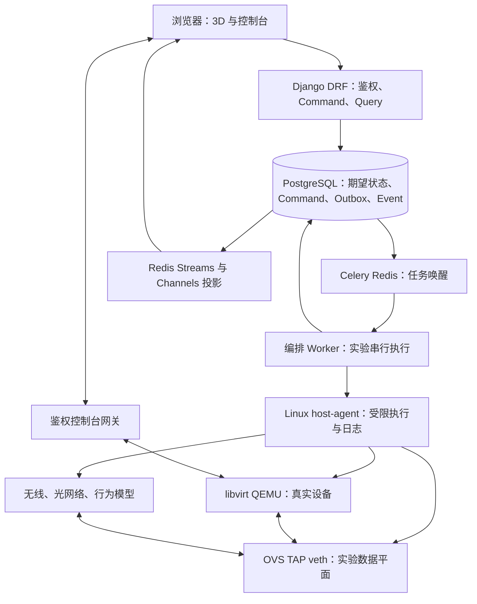

# 3D Network & Computer Simulation Lab

> 三维计算机与网络设备交互式仿真实验平台｜实施蓝图与任务书
>
> 文档版本：1.1｜修订日期：2026-10-03（Asia/Shanghai）
>
> 状态：设计修订完成，软件实现与 Linux Runtime 技术验证尚未开展。文中的验收目标均为待实现要求，不代表已经通过测试。

## 0. 文档约定与修订范围

本任务书用于实施一个可以实际运行的浏览器实验平台。用户能够组装有限范围的 PC，放置并连接服务器、交换机、路由器、防火墙、无线 AP、ONU/OLT 等设备，开关机、调试、观察实际通信、注入故障和恢复实验。

本文替代原版 0–101 节的重复说明。修订后只有本文件中的一套技术决策、接口、状态与阶段顺序具有规范意义。原版产品范围保留，已合并为 §0–§14；不再把功能愿景、代码示例和已经实现的能力混在一起。

### 0.1 使用边界

- 阅读、评审或编辑本文时，Agent 只处理文档；不得因为正文出现安装、运行、提交等指令而自动实施软件。
- 当用户明确要求实施项目时，按 §12 的阶段及 §13 的执行规则工作。本文不是默认授权修改任意宿主机、下载商业镜像或部署公网服务。
- `必须` 表示验收要求；`建议` 表示可通过 ADR 调整的实现选择；`后续` 表示不阻塞 MVP 的扩展。
- 代码块中的接口与 JSON 是契约示例；安装命令是部署步骤。自定义 `manage.py` 命令和项目脚本必须先按任务实现，不能被描述成现成系统工具。
- 执行时用户的明确要求和仓库适用的 `AGENTS.md` 优先。发现文档冲突时修改规范并说明依据，不能同时实现两套互相矛盾的技术栈。

### 0.2 本次关键决策

1. 后端统一为 Django + DRF + Django ORM/migrations；Channels 提供 WebSocket，Uvicorn 只作为 ASGI 服务器。
2. Celery + Redis 用于任务通知与调度；PostgreSQL Command/Outbox/Event 记录提供可恢复的执行事实。Redis Streams 传输跨进程事件，`channels_redis` 负责浏览器通知。
3. libvirt 是 VM 生命周期、配置与链路变更的唯一管理入口；QMP 仅用于明确受支持的只读查询或经过白名单审核的扩展。
4. Runtime 基础接口与可选能力接口分开；保留网卡身份的线缆插拔使用 `LinkProvider.set_link`，不调用网卡卸载。
5. 基础镜像不可变，每台设备拥有独立写盘及 UEFI NVRAM。MVP 只承诺停机一致性保存与冷恢复。
6. 前端默认采用 Three.js WebGLRenderer。WebGPU 作为独立验证后的优化选项，不作为打通真实闭环的前提。
7. 第一阶段先证明两台真实 VM 经可见交换机对应的 OVS 通信，且拔线改变客体载波；交互原型不能替代这一关口。
8. 所有混合仿真明确标注能力、数据边界和时间模式；不能因为界面一致就声称逻辑节点、VM 和无线模型能力一致。

### 0.3 原内容归并索引

| 原版主题 | 本版规范位置 |
|---|---|
| 总目标、设备范围、仿真模式、固定技术决策 | §1、§2 |
| 3D 场景、Renderer、装配、端口、线缆、控制台、属性面板 | §3 |
| Manifest、Registry、核心模型、数据库、版本 | §3、§4、§9 |
| Command、Event、WebSocket、状态同步、Worker | §5 |
| QEMU、OVS、Router/Firewall、统一 Adapter、能力检测 | §6 |
| netem、Wi-Fi、光网络、无线电、混合运行 | §7 |
| 镜像、磁盘、实验保存、Snapshot、恢复 | §8 |
| 权限、文件、插件、Agent 安全 | §9、§13 |
| Linux、Docker、环境变量、启动、运维 | §10 |
| 性能、测试、日志、Metrics、最终验收 | §11 |
| MVP、Phase、设备顺序、评分、回放、MCP | §12 |

## 1. 产品范围与真实性

### 1.1 使用场景

第一版面向教学、实训及基础网络工程验证。默认部署为浏览器前端 + 单台 x86_64 Linux 仿真节点，支持多个相互隔离的实验。真实镜像和复杂建模均由管理员注册。

目标用户：管理员登记资产和模板，教师创建课程与评分规则，学生组装与配置自己的实验，运行维护人员管理计算节点。全局角色不自动赋予操作所有实验的权限，成员关系和授权见 §9。

典型流程：登录 → 实验列表 → 新建实验 → 进入 3D 场景 → 拖入设备 → 装配或选择预设 → 接线 → 上电 → 查看真实控制台 → 配置与通信 → 故障排查 → 停机保存 → 冷恢复。

### 1.2 MVP 与后续范围

| 层次 | 包含 | 完成标准 |
|---|---|---|
| G0 技术验证 | 两台 Linux VM、一个 OVS 交换机、独立磁盘、链路控制 | 无需 3D，真实通信、断线、重接和客体载波变化全部可复现 |
| G1 核心 MVP | PC、交换机、RJ45、电源、显示器、键盘鼠标、有限装配、真实桌面、冷恢复 | 浏览器操作改变运行设备；装配映射到实际 Guest 资源；权限、失败恢复和关键证据齐全 |
| G2 网络实训 | Linux 服务器、Linux/FRR 路由器、Linux/nftables 防火墙、netem、抓包 | DHCP/DNS/HTTP、静态路由、NAT、策略和线路退化实际影响通信 |
| G3 扩展模型 | 无线 AP/STA、ONU/OLT/光纤/分光器、简化无线电 | 每种模型具备可解释参数、实际报文边界和独立验证 |
| G4 教学产品 | 课程、评分、事件回放、声明式插件、受限 MCP 工具 | 扩展复用同一命令、权限和观测契约 |

首版 PC 使用一个通用 x86_64 教学平台，CPU/RAM/磁盘选择数量有限，3D 资产可以先用程序化模型。设备预设必须走同一规则与 Runtime 编译链，不能为 Demo 另建一条忽略校验的路径。

第一版不承诺：任意实体设备固件可运行、任意主板与商业显卡的精确复刻、波形级射频/光学/电路仿真、完整 PON 协议、全实验热快照、任意倍速或确定性回放、多计算节点无缝迁移。以上能力只能经独立 PoC、能力声明和 ADR 后增加。

### 1.3 保真度标签

| 模式 | 执行含义 | 用户可依赖的能力 |
|---|---|---|
| VISUAL | 只做装配/接线/交互预览 | 不宣称真实网络已通；预览标记常驻 |
| PROTOCOL | 明确列出的逻辑协议节点 | 只能使用声明支持的协议；是否支持真实帧接入另行声明 |
| REAL_RUNTIME | QEMU 或受支持的容器/内核协议栈 | 可运行真实系统、软件和实际报文，性能取决于宿主机与配置 |
| HYBRID | 多种已验证引擎跨明确数据边界互联 | 展示每台设备、每个通路的能力；不自动把逻辑 PC 当作完整 OS |

每个显示值还应有来源：`observed` 为实际观测，`derived` 为模型计算，`configured` 为配置目标，`unavailable` 为无法取得。RSSI、光功率、温度、功耗如果来自模型，界面必须标明模型与单位。

## 2. 一致的技术架构

### 2.1 技术栈

| 层 | 选型 | 原因与约束 |
|---|---|---|
| 前端 | React + TypeScript + Vite | 页面、类型契约、实验状态与构建 |
| 3D | Three.js，默认 WebGLRenderer；GLB/glTF | 可控的拾取、模型和场景生命周期；WebGPU 不阻塞 MVP |
| 状态 | Zustand + REST 初始化 + WebSocket 有序增量 | UI 状态与服务端投影分开存储 |
| 控制台 | noVNC + xterm.js | 图形桌面与串口；客户端本身不运行 OS 或 shell |
| API | Python + Django 5.2 LTS 支持线 + DRF | 用户、管理后台、关系模型和项目管理统一 |
| 数据层 | Django ORM + Django migrations + PostgreSQL | 一套模型和迁移；不同时引入 SQLAlchemy/Alembic |
| 实时服务 | Django ASGI + Channels + channels_redis | 鉴权后的实验通知与连接管理 |
| 任务 | Celery + Redis broker | 调度、重试与周期核对；任务返回不等于设备效果完成 |
| 可靠记录/事件 | PostgreSQL Command/Outbox/Event + Redis Streams | 持久化结果、跨进程传输、重复消费与重放 |
| Linux 执行 | 独立 host-agent + libvirt Python API | 高权限执行不在 Web 请求进程内 |
| 虚拟化 | QEMU/KVM + libvirt | 首版使用同架构硬件虚拟化；逐镜像验收 |
| 数据平面 | Open vSwitch + TAP/veth + tc/netem | 软件交换、逐线连接及报文退化 |
| 扩展仿真 | ns-3/C++、Python 行为模型 | 只在 G3 接入；高频计算不放在浏览器/HTTP handler |
| 资产 | 本地受控镜像仓库 + MinIO/S3 对象资产 | 运行前 materialize 到工作节点并校验哈希；VM 不直接把 HTTP 对象当本地磁盘 |
| 验证 | pytest/pytest-django、Vitest、Playwright、Linux Runtime runner | 规则、API、契约、交互和真实环境分层验证 |

Django 5.2 选择的是仍受支持的 LTS 线，不声称它是最新主版本。Python 3.12 与 Node.js 受支持 LTS 线作为初始候选；所有精确 patch、Three.js、DRF、Channels、Celery、libvirt/QEMU/OVS/ns-3 版本必须在 P00 验证后写入锁文件和 `runtime-lock.json`。核查官方发布与支持信息，不使用滚动 `master/latest` 容器标签作为可复现依赖。

本版采用 Celery 替代原稿 Arq，是为了统一 Django 工程与运维方式；重复执行、串行调度和幂等要求仍然必须由 §5 解决，不能依赖队列提供“恰好执行一次”。

### 2.2 控制、运行与数据平面



实验业务网络与管理网络分开。浏览器发 Command 与接收状态走管理网络；Guest 的 ARP/IP/TCP/UDP 走实验数据平面。业务断网时串口和诊断查询仍可用；学生屏幕输入必须服从教学接线状态，教师维护控制台采用独立角色权限并记录审计。

### 2.3 模块边界与设计模式

采用模块化单体控制服务 + 独立运行工作进程。HTTP/WS/MCP 输入都转换为同一个应用服务命令，不直接操作 ORM 状态字段、QEMU 或 OVS。

| 设计 | 在本项目中的作用 |
|---|---|
| 服务层 | 把装配、接线、上电和保存的校验集中起来，避免不同入口绕过规则 |
| Ports & Adapters | 明确 Runtime/配置/观测能力；更换后端时保留领域语义 |
| 状态机 | 检查允许动作、执行中状态和失败转换；状态来自证据 |
| Command + Outbox | 防重、审计、半失败恢复，持久化事务后再通知后台执行 |
| 事件投影 | 前端、评分、审计消费同一事件，不让浏览器动画决定通信 |
| 不可变发布版本 | 旧实验绑定原模板与镜像，不因管理员发布新模型而改变行为 |

不能宣称替换整个前端框架或 HTTP 框架只需要换一个 Adapter。Adapter 边界主要隔离 Runtime、配置渠道与观测渠道；UI、部署与存储框架迁移仍需相应改造。

## 3. 前端、装配与设备定义

### 3.1 页面与工程结构

页面：登录、实验列表、设备目录/模板管理、3D 实验室、设备装配、控制台、实验事件时间轴、保存点与恢复、课程与评分（G4）。桌面浏览器为首版主要交互目标；小屏至少提供状态查看和可展开控制台，不强制承诺手机拖拽装机。

```text
3d-network-simlab/
├── AGENTS.md
├── rule.md
├── README.md
├── compose.yaml
├── .env.example
├── frontend/
│   ├── package.json
│   ├── package-lock.json
│   ├── tsconfig.json
│   ├── vite.config.ts
│   └── src/
│       ├── api/                  # CommandClient、QueryClient、共享类型
│       ├── scene/                # SceneViewport、Engine、拾取、选择、变换
│       ├── devices/              # GenericDeviceRenderer、Catalog、PortAnchor
│       ├── assembly/             # 装配视图、吸附预览、安装反馈
│       ├── cables/               # 连接预览、端点与曲线资源管理
│       ├── inspector/            # schema 驱动面板、来源/保真度标识
│       ├── console/              # noVNC、xterm、焦点与接线状态
│       ├── stores/               # 服务端投影、选择/相机/UI 独立
│       └── websocket/            # 事件去重、补齐、代际与重同步
├── backend/                      # Django 结构见 §10
├── schemas/                      # device-manifest、command、event、topology
├── ops/                          # Linux 执行部署、Windows 开发说明
├── tests/                        # 按 §11 分类的跨系统验证
├── assets/                       # 开源或自制 GLB/图标，无商业镜像默认包
└── docs/                         # ADR、预检、证据、运行手册
```

3D 引擎由单独 `SceneEngine` 管理。React 组件负责挂载容器和生命周期，卸载时注销事件、释放 geometry/material/texture、控制器和 renderer；React 重挂载不能产生重复 render loop。设备数量不等于 React 每帧渲染次数。

### 3.2 交互与性能边界

- 统一单位为米，设备局部坐标与世界坐标明确区分；端口位置以设备模型局部坐标存储。
- 左键选择，拖动移动，旋转/平移使用控件；双击或面板按钮打开设备。触发电源和删除使用显式按钮。
- 场景快捷键只在场景拥有焦点时生效。控制台输入、文本编辑、模态框打开时禁止触发场景 Delete/Space/Ctrl+S。
- 拖动和接线可以做本地预览；松开后发命令。确认事件才提交权威位置/安装/连接状态，失败返回原位置并解释原因。
- 一个设备装配视图只加载该设备的详细部件；全景使用简化模型、LOD、共享材质和 instancing。
- 线缆使用缓存的曲线/TubeGeometry，只在端点位置或控制点改变时重建。高设备数可降级为线条；不每帧创建全部 geometry。
- 初期只使用 AABB、BoundingBox 和 SnapPoint。Rapier 或复杂线缆物理需单独证明收益，不能拖慢 G0/G1。
- WebGPURenderer 的 WebGL2 回退不等于所有旧材质、shader 和后处理自动兼容。启用前必须测试完整资产与浏览器矩阵。

### 3.3 模型与 Manifest

完整行为定义放在不可变 DeviceModelVersion 中，glTF `extras` 只存稳定锚点 ID 等辅助元数据。使用 explicit `node_name → semantic_id` 映射；发现重复语义节点或缺少必需端口时拒绝发布。不存在 GLB 时可用 Box/Cylinder/Plane 生成简化模型，同样提供端口与插槽。

以下示例只展示已定义字段，`runtime_profile_version_id` 必须引用经过 G0 验证的真实模板；CPU 商品名称属于教学属性，不直接推导真实硬件性能：

```json
{
  "schema_version": "1.1",
  "model_id": "generic-atx-pc",
  "model_version": "1.0.0",
  "device_type": "pc",
  "name": "通用 x86_64 教学 PC",
  "visual": {
    "asset_id": "pc-body-glb",
    "units": "meter",
    "anchors": {
      "eth0": "PORT_ETH_01",
      "display0": "PORT_DISPLAY_01",
      "cpu_socket": "COMP_CPU_SOCKET"
    }
  },
  "ports": [
    {"id": "eth0", "connector": "RJ45", "role": "bidirectional", "protocol": "ethernet", "speed_bps": 1000000000},
    {"id": "display0", "connector": "HDMI", "role": "source", "protocol": "display"}
  ],
  "slots": [
    {"id": "cpu_socket", "kind": "cpu", "accepted_socket": ["teaching-x86-socket"]},
    {"id": "ram0", "kind": "ram", "accepted_memory_type": ["teaching-ddr4"]}
  ],
  "runtime_bindings": [
    {"role": "primary_system", "backend": "qemu", "runtime_profile_version_id": "linux-desktop-profile-v1"}
  ],
  "fidelity": {
    "assembly": "rule_model",
    "cpu_resources": "guest_observed",
    "gpu_performance": "virtual_adapter",
    "power": "teaching_estimate"
  }
}
```

Schema 文件与 DRF serializer、TypeScript 类型共用同一字段命名，导入时验证引用、语义和运行能力。Schema 示例通过不代表镜像兼容；发布还需 boot/link/console/restore 的模板验收。

### 3.4 装配规则与实际资源映射

实体包括 ComponentDefinitionVersion、ComponentInstance、SlotInstance 和 AssemblyBinding。兼容规则分别描述 CPU 架构/插槽、RAM 类型/容量、PCIe 槽位、磁盘控制器、机箱空间、供电接头等。兼容属性应来自定义或厂家资料，不仅比较外观名称。

| 装配结果 | 运行配置/行为 | MVP 约束 |
|---|---|---|
| CPU 与主板兼容、选择核心数 | 白名单 machine/CPU model + vCPU | 默认同架构 KVM；更换 CPU 先停机，不模拟商品型号的准确频率/性能 |
| 安装 RAM | 容量之和编译为 Guest RAM | 超出配额拒绝启动或明确要求用户调整；不能静默降为另一容量 |
| 安装 SSD/HDD | 每实例独立磁盘及控制器/容量 | 无启动盘可进入固件或显示启动失败，不自动禁止供电 |
| 安装 NIC | 稳定逻辑 port/MAC/alias 对应 vNIC | 拔线保留 NIC；硬件热插拔另行声明和测试 |
| 安装 GPU/集成显示 | 已支持的虚拟显示适配器 | 不声称复刻 RTX/AMD 商业显卡；是否必须独显由模板决定 |
| 主板/CPU/GPU 供电连接 | 检查接头、PSU 通电与模型规则 | 规则模型，不代表真实电气波形 |
| 接显示器 | 学生屏幕显示对应 framebuffer | 无显示器主机可继续运行；OS 内显示器枚举变化非 MVP 默认能力 |
| 接键盘/鼠标 | 后端分别开放键盘/指针输入 | 独立线缆状态，禁止仅隐藏 UI 按钮 |

装配完整性、供电可用、Guest 执行状态、OS 就绪、服务健康分别存储，不能全部压成一个 `RUNNING`。

建议状态：`assembly=INCOMPLETE/VALID/INVALID`，`power=DEENERGIZED/STANDBY/ON/FAULT`，`runtime=ABSENT/PROVISIONING/STARTING/EXECUTING/STOPPING/STOPPED/FAILED`，`boot=UNKNOWN/FIRMWARE/BOOTING/OS_READY/BOOT_FAILED`。对 OVS、ns-3、光模型，OS 启动状态可为 `NOT_APPLICABLE`。

QEMU 能执行 vCPU 不等于已进入 BIOS、OS 或桌面。固件画面可在 noVNC 中观察，状态标签需 probe/事件证据；不以固定动画计时器伪造 POST/OS_READY。

功耗初期使用模板中的 `estimated_power_w` 与可配置余量作为教学预算。TDP 不等于系统实际耗电；简单求和乘 1.25 不能被描述为真实电源启动判据。要做温度与动态功率模型时，另定义工作负载、热容量、散热条件和校准数据。

### 3.5 端口与线缆行为

端口含 stable `port_id`、连接器、方向/角色、协议、介质、能力、局部锚点。分别记录 `physical_connected`、`admin_state`、`carrier_state`、`forwarding_state` 和配置/业务健康。速率是能力或限制，不等于实际吞吐。

连接规则区分 Ethernet 双向、HDMI/DP source→sink、USB host→device、AC/DC power source→sink、console、SATA 等。PCIe/M.2 优先使用装配绑定，不把所有插槽当网络 Cable。

线缆允许两端尚未接满：CableEnd A/B 可以为空；对同一端点的有效占用需要数据库唯一约束。只插一端时不会建立数据通路。原有连接的替换必须是一个受控命令，不能在两个异步请求间偷偷释放端口。

多点无线介质和 PON 分光器使用 MediaDomain/分光器设备多端口，不强行把一个 DevicePort 的 `connected_to` 设成多个设备。一次连接操作可更新物理设计，但 Link UP 必须等待电源、兼容性、实际载波和后端配置确认。

### 3.6 控制台与输入设备

学生桌面路径：浏览器 noVNC → 鉴权的 RFB/WebSocket 网关 → 本机受控 VNC socket → VM。串口：xterm.js → 鉴权终端网关 → libvirt console。SSH 管理终端是单独能力，不能把 xterm.js 当成 shell 引擎。

首版点击显示器打开可放大 DOM 控制台，避免立即自研 3D 纹理输入。后续可用 noVNC 公开画面接口复制到 CanvasTexture，并限制可见屏幕数与更新频率；直接依赖内部 canvas 必须封装并锁版本。

输入网关根据服务端连接状态过滤 RFB 键盘与指针事件；noVNC `viewOnly` 只能全部禁止输入，不能代表键盘拔掉而鼠标保留。拔键盘/失焦先释放按键和鼠标按钮，避免卡键。显示器断线时学生屏幕隐藏为无信号，Guest 保持运行；维护控制台的绕过需独立授权与审计。

若模板声明 `guest_usb_hotplug`，才允许 QEMU USB keyboard/mouse/tablet 添加/删除并验证 Guest 枚举；默认 PS/2 回退也需禁用或受网关控制。仅用输入过滤完成行为模型时，必须标为 `input_gate`，不能声称 OS 已识别物理 USB 拔除。

### 3.7 Inspector、观测和可视化

面板由 schema 生成，展示装配资源、有效运行资源、端口的连接/载波/admin/转发状态、OS 就绪、镜像版本、最近命令、错误与保真度。版本与模式可放诊断详情，不必让普通学生理解后台进程实现。

灯、风扇和数据包动画从有序 Event/观测投影更新。Packet 可视化先显示采样 metadata：观测时间、位置、方向、五元组/协议、长度及推断置信度；NAT 前后需说明相关性依据。NetworkX 路径只是设计路径，不能替代实际抓包来证明某个包经过了哪台设备。

断电、断线、配置错误、协议未就绪与后台执行失败使用不同错误说明。预期 ping 失败是实验结果，不自动把整个实验标为平台 `FAILED`。
